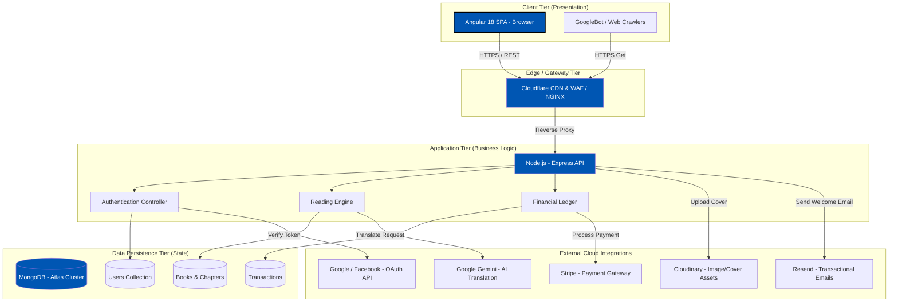
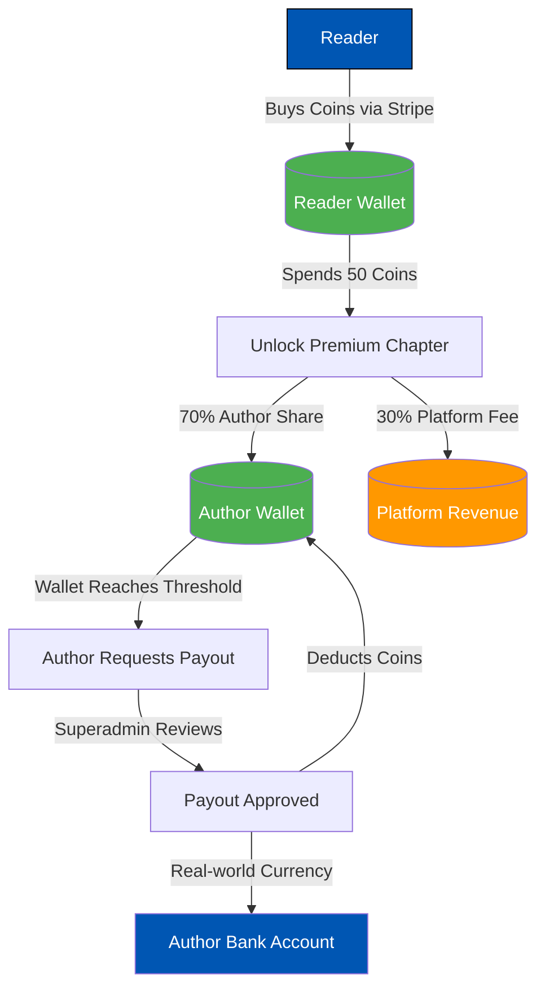

<h1>1. Project Overview & Comprehensive Scope</h1>

The <strong>Mozhibu - Story</strong> platform is a multi-faceted digital ecosystem engineered to bridge the gap between storytellers and readers across diverse languages. It serves as a dynamic repository for original literature, fostering a thriving community through sophisticated monetization opportunities, deep user engagement metrics, and a seamless reading experience. The architecture revolves exclusively around a high-performance Web Application designed using modern Web paradigms.

---

<h2>1.1 Executive Summary & Market Positioning</h2>

Mozhibu - Story capitalizes on the shift towards accessible web platforms by providing a highly scalable, full-stack web solution built upon cutting-edge technologies. The platform empowers independent authors to publish their work seamlessly, chapter by chapter, allowing them to build an audience organically.

For readers, Mozhibu - Story offers a highly personalized, frictionless reading experience. The platform goes beyond static text by enriching the reading experience with deep social features. Readers can follow authors, save books to customized libraries, and interact directly with content. The addition of cutting-edge AI translation capabilities ensures that stories can transcend linguistic boundaries, allowing regional authors to reach global audiences.

<blockquote>
<strong>Core Mission Statement:</strong> To democratize global storytelling by providing a robust, equitable, and highly engaging technological platform where linguistic diversity is celebrated, raw creativity is financially rewarded, and the act of reading is elevated through seamless technology.
</blockquote>

---

<h2>1.2 Deep Dive: Core Platform Modules & Subsystems</h2>

The system is logically partitioned into multiple sub-modules, each serving distinct personas (Readers, Authors, and Superadmins).

<table>
  <thead>
    <tr>
      <th>Module</th>
      <th>Exhaustive Description & Workflows</th>
      <th>Primary Actor</th>
    </tr>
  </thead>
  <tbody>
    <tr>
      <td>Author Studio & Content Publishing</td>
      <td>
        
A comprehensive Web-based authoring interface. Authors can:

        <ul>
          <li>Create book metadata (Title, Synopsis, Tags, Categorized Genres).</li>
          <li>Upload Cover Art which is automatically processed and optimized.</li>
          <li>Draft, auto-save, and publish individual Chapters.</li>
          <li>Manage chapter settings, including deciding whether a chapter is "Free" or "Premium" (requiring coins to unlock).</li>
          <li>View advanced analytics regarding reads, reader retention, and coin earnings.</li>
        </ul>
      </td>
      <td>Writers / Authors</td>
    </tr>
    <tr>
      <td>Reader Core & Engagement</td>
      <td>
        <ul>
          <li><strong>Personalized Discovery:</strong> Suggesting content based on user's selected language and genres.</li>
          <li><strong>Interactive Reading:</strong> Real-time bookmarking, progress tracking, and chapter completion metrics. The "Continue Reading" system automatically saves progress.</li>
          <li><strong>Translation (Gemini AI):</strong> Real-time translation of chapters into the reader's preferred language using the integrated Google Gemini API.</li>
          <li><strong>Social Interactions:</strong> Leaving comments, liking chapters, and following favorite authors.</li>
        </ul>
      </td>
      <td>Readers</td>
    </tr>
    <tr>
      <td>Authentication & Profiling</td>
      <td>
        <ul>
          <li><strong>Multi-Auth Pipeline:</strong> Traditional JWT-based local authentication paired with Google and Facebook OAuth integration.</li>
          <li><strong>Onboarding Flow:</strong> Strict state checks ensuring users provide necessary demographic data (DOB, Mobile, Preferred Genres) before proceeding into the ecosystem.</li>
          <li><strong>Role Management:</strong> Distinct roles (`user`, `author`, `superadmin`) dictating access levels across the system.</li>
        </ul>
      </td>
      <td>All Users</td>
    </tr>
    <tr>
      <td>Monetization & Financials (Coins)</td>
      <td>
        <ul>
          <li><strong>Virtual Currency:</strong> Readers purchase "Coins" which act as the platform's primary medium of exchange.</li>
          <li><strong>Premium Chapters:</strong> Authors can lock chapters. Readers spend coins to unlock these chapters permanently for their account.</li>
          <li><strong>Author Revenue:</strong> When a reader spends coins, the corresponding author earns revenue based on a defined conversion rate.</li>
          <li><strong>Payout System:</strong> Authors can request real-world currency payouts once their wallet reaches a minimum threshold.</li>
        </ul>
      </td>
      <td>Readers / Authors</td>
    </tr>
    <tr>
      <td>Subscriptions (Mozhibu Premium)</td>
      <td>
        <ul>
          <li><strong>Tiered Access:</strong> Users can subscribe to "Standard" or "Premium" tiers via Stripe integration.</li>
          <li><strong>Benefits:</strong> Subscribers may receive monthly coin stipends, ad-free reading, and access to exclusive subscriber-only content.</li>
        </ul>
      </td>
      <td>Readers</td>
    </tr>
    <tr>
      <td>Superadmin Governance</td>
      <td>
        <ul>
          <li><strong>Content Moderation:</strong> Admins can review, flag, or remove inappropriate books or chapters.</li>
          <li><strong>Financial Oversight:</strong> Reviewing and approving author payout requests. Tracking total platform revenue.</li>
          <li><strong>System Configuration:</strong> Managing global settings (contact emails, coin conversion rates, active banners, ad placements).</li>
          <li><strong>Competitions:</strong> Creating and managing writing competitions to spur community engagement.</li>
        </ul>
      </td>
      <td>Superadmins</td>
    </tr>
  </tbody>
</table>

---

<h2>1.3 System Architecture Topology & Traffic Flow</h2>

The system follows a modern decoupled architecture. The frontend is a Single Page Application (SPA) built with Angular 18, and the backend is a Node.js/Express REST API communicating with a MongoDB database.

### Detailed Component Diagram

<strong>Traffic Flow Explanation:</strong> The web client (Angular) directly interfaces with the Edge/Proxy layer. Asset requests (like book covers) are served directly from Cloudinary or a CDN. Dynamic API calls are routed to the Express.js Backend which processes business logic. The backend acts as a central orchestrator, communicating with MongoDB Atlas via Mongoose models for data persistence, and interfacing with a suite of external APIs (Stripe for payments, Gemini for translation, Resend for emails) to execute complex workflows securely. Authentication tokens (JWT) are heavily utilized to secure endpoints across the Application Tier.

---

<h2>1.4 The Monetization Lifecycle</h2>

A critical aspect of Mozhibu is how value flows through the system. This distinguishes it from simple reading platforms.

### The Coin Economy Flow

This sequence ensures that content creators are directly compensated for their engaging work, while readers have a seamless micro-transaction experience.

---

<h2>1.5 Technical Non-Functional Requirements</h2>

To support the above features, the system is designed with strict adherence to several non-functional requirements (NFRs):

1. **Scalability:** The Node.js API is stateless (relying on JWTs rather than session cookies), allowing horizontal scaling across multiple container instances. MongoDB Atlas supports automatic sharding and replica sets for data scaling.
2. **Security:** 
   - All passwords are hashed using bcrypt.
   - API endpoints are protected against brute force attacks using Express Rate Limiters.
   - Cross-Site Request Forgery (CSRF) tokens are implemented for sensitive state-changing operations.
   - Input validation and sanitization are enforced using Mongoose schema validation and custom middleware to prevent NoSQL injection and XSS.
3. **Performance:** 
   - Heavy operations (like retrieving the home page feed of trending/popular books) are optimized using Mongoose `.lean()` queries and strategic database indexing on fields like `views`, `genre`, and `createdAt`.
   - The Angular frontend utilizes Server-Side Rendering (SSR) via Angular Universal for faster First Contentful Paint (FCP) and critical SEO indexing.
4. **Resilience:** External API failures (e.g., Gemini translation timeout) gracefully degrade, showing fallback messages to the user without crashing the core reading experience.