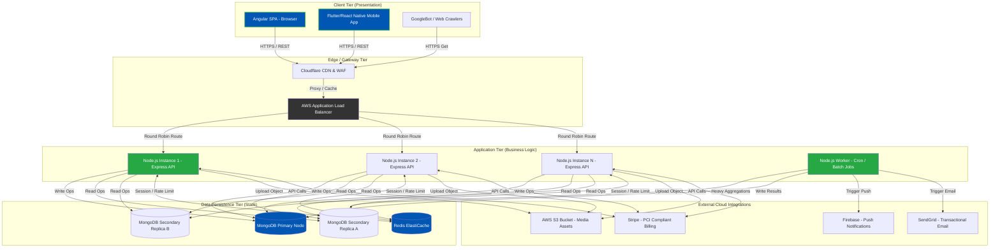

<h1 style="color: #0056b3; border-bottom: 2px solid #28a745; padding-bottom: 10px;">1. Project Overview & Comprehensive Scope</h1>

The <strong>Mozhibu - Story</strong> platform is a massive, multi-faceted digital ecosystem meticulously engineered to bridge the gap between passionate storytellers and avid readers across diverse linguistic landscapes. It is not merely a reading app; it is a full-fledged literary economy. At its core, the platform serves as a dynamic repository for original literature, fostering a thriving community through competitive events, sophisticated monetization opportunities, and deep user engagement metrics.

---

<h2 style="color: #28a745;">1.1 Executive Summary & Market Positioning</h2>

In the modern digital era, the consumption of written content has shifted dramatically towards highly accessible, mobile-first platforms that offer immediate gratification and real-time community interaction. Traditional publishing gatekeepers are being bypassed in favor of direct-to-consumer serialized fiction. Mozhibu - Story capitalizes on this monumental shift by providing a highly scalable, full-stack web and mobile solution built upon cutting-edge technologies. 

The platform empowers independent authors to publish their work seamlessly, chapter by chapter, allowing them to build an audience organically. By participating in high-stakes, platform-sponsored writing competitions (such as the flagship "Twelve Tongues Prize"), writers can accelerate their discoverability. Furthermore, writers can earn a sustainable revenue stream through a sophisticated subscription and engagement-based payout system. 

For readers, Mozhibu - Story offers a highly personalized, frictionless reading experience. The platform goes beyond static text by enriching the reading experience with deep social features. Readers can follow authors, receive push notifications for new chapter releases, save books to customized offline libraries, and leave granular reviews that influence the platform's recommendation algorithms.

<blockquote style="border-left: 5px solid #0056b3; padding-left: 15px; color: #333; background-color: #f9f9f9; padding-top: 10px; padding-bottom: 10px;">
<strong>Core Mission Statement:</strong> To democratize global storytelling by providing a robust, equitable, and highly engaging technological platform where linguistic diversity is celebrated, raw creativity is financially rewarded, and the act of reading is elevated through seamless technology.
</blockquote>

---

<h2 style="color: #28a745;">1.2 Deep Dive: Core Platform Modules</h2>

The system is divided into several highly complex modules, each operating with its own set of business rules and database interactions.

<table style="width: 100%; border-collapse: collapse; margin-bottom: 20px;">
  <thead>
    <tr style="background-color: #0056b3; color: white;">
      <th style="padding: 12px; border: 1px solid #ddd; text-align: left;">Module</th>
      <th style="padding: 12px; border: 1px solid #ddd; text-align: left;">Exhaustive Description & Workflows</th>
      <th style="padding: 12px; border: 1px solid #ddd; text-align: left;">Primary Actor</th>
    </tr>
  </thead>
  <tbody>
    <tr>
      <td style="padding: 12px; border: 1px solid #ddd; font-weight: bold; color: #0056b3;">Author Studio & Content Publishing</td>
      <td style="padding: 12px; border: 1px solid #ddd;">
        
A comprehensive Word-processor-like interface. Authors can:

        <ul>
          <li>Create book metadata (Title, Synopsis, Tags, Categorized Genres).</li>
          <li>Upload Cover Art which is automatically compressed, cropped, and pushed to AWS S3.</li>
          <li>Draft, auto-save, and publish individual Chapters.</li>
          <li>Set content warnings (NSFW, Mature tags) to comply with App Store guidelines.</li>
          <li>Track real-time analytics (Views per chapter, Drop-off rates, Likes, Comments).</li>
        </ul>
      </td>
      <td style="padding: 12px; border: 1px solid #ddd;">Verified Writers</td>
    </tr>
    <tr style="background-color: #f2f2f2;">
      <td style="padding: 12px; border: 1px solid #ddd; font-weight: bold; color: #0056b3;">Reader Interface & Library Management</td>
      <td style="padding: 12px; border: 1px solid #ddd;">
        
An immersive, distraction-free reading UI. Features include:

        <ul>
          <li>Customizable typography (Font size, Serif/Sans-serif toggles, Line height).</li>
          <li>Theming (Light mode, Dark mode, Sepia, AMOLED black).</li>
          <li>Continuous scrolling or paginated swiping based on user preference.</li>
          <li>Automatic progress synchronization. If a user reads Chapter 3 on their phone on the train, their tablet will open to Chapter 3 at home.</li>
          <li>Offline caching of 'Saved' books via Service Workers.</li>
        </ul>
      </td>
      <td style="padding: 12px; border: 1px solid #ddd;">Readers</td>
    </tr>
    <tr>
      <td style="padding: 12px; border: 1px solid #ddd; font-weight: bold; color: #0056b3;">Monetization & The Subscription Engine</td>
      <td style="padding: 12px; border: 1px solid #ddd;">
        
A dual-tier financial system powering the creator economy:

        <ul>
          <li><strong>Premium Subscription:</strong> Readers pay a monthly fee via Stripe to bypass ads, unlock 'Premium Only' chapters, and get early access to updates.</li>
          <li><strong>Author Earnings Pool:</strong> The system tracks every 'Qualified Read' (e.g., user spends > 60 seconds on a chapter). At the end of the month, a Cron job aggregates total platform subscription revenue and distributes it to authors proportionally based on their share of total Qualified Reads.</li>
          <li><strong>Direct Tipping/Coins:</strong> (Future feature) Readers purchasing digital currency to tip authors directly.</li>
        </ul>
      </td>
      <td style="padding: 12px; border: 1px solid #ddd;">Readers & Writers</td>
    </tr>
    <tr style="background-color: #f2f2f2;">
      <td style="padding: 12px; border: 1px solid #ddd; font-weight: bold; color: #0056b3;">Competitions & Gamification Engine</td>
      <td style="padding: 12px; border: 1px solid #ddd;">
        
A robust system designed to drive user acquisition:

        <ul>
          <li>Admins define time-bound contests with specific criteria (e.g., Language: Tamil, Theme: Sci-Fi, Min words: 5000).</li>
          <li>Automated eligibility checks when an author attempts to submit a book to the contest.</li>
          <li>Real-time leaderboards calculated via Redis based on a proprietary Engagement Algorithm (combining Views, Completion Rates, and Unique Likes).</li>
        </ul>
      </td>
      <td style="padding: 12px; border: 1px solid #ddd;">Writers & Admins</td>
    </tr>
    <tr>
      <td style="padding: 12px; border: 1px solid #ddd; font-weight: bold; color: #0056b3;">Administration, Moderation, & Compliance</td>
      <td style="padding: 12px; border: 1px solid #ddd;">
        
A secure internal tool for platform operators:

        <ul>
          <li><strong>Report Handling:</strong> Triaging user-submitted reports of plagiarism, hate speech, or inappropriate content.</li>
          <li><strong>Author Verification:</strong> Reviewing KYC (Know Your Customer) or identity documents before allowing an author to receive bank payouts.</li>
          <li><strong>System Config:</strong> Dynamically adjusting the 'Qualified Read' timer or the percentage of revenue split between the Platform and Authors without deploying code.</li>
        </ul>
      </td>
      <td style="padding: 12px; border: 1px solid #ddd;">Super Admins</td>
    </tr>
  </tbody>
</table>

---

<h2 style="color: #28a745;">1.3 Exhaustive User Journey Mapping</h2>

To truly understand the system architecture, one must trace the exact paths users take through the application.

  <h3 style="color: #0056b3; margin-top: 0;">Journey A: The Reader Lifecycle</h3>
  <ol style="color: #333; line-height: 1.6;">
    <li><strong>Acquisition:</strong> User lands on the homepage via an SEO-optimized book link. They are prompted to download the app or continue on the web.</li>
    <li><strong>Onboarding:</strong> User signs up using OAuth (Google/Facebook). The backend generates a JWT token and a fresh `User` document.</li>
    <li><strong>Personalization:</strong> The user selects their `preferredLanguage` and `favoriteGenres`. The frontend saves this and queries the `/api/books/recommendations` endpoint.</li>
    <li><strong>Engagement:</strong> The user finds a book, adds it to their Library (`savedBooks` array updated in DB). They open Chapter 1.</li>
    <li><strong>Tracking:</strong> As they scroll, the Angular frontend sends debounced heartbeat pulses to the Node.js backend. Once a threshold is passed, the backend logs a `ReadingProgress` event.</li>
    <li><strong>Conversion:</strong> At Chapter 10, the content is locked. A paywall appears. The user inputs their credit card. Stripe processes the payment, fires a webhook to the Node server, which upgrades the user to `isPremium: true`. Chapter 10 instantly unlocks.</li>
  </ol>

  <h3 style="color: #28a745; margin-top: 0;">Journey B: The Writer to Earner Pipeline</h3>
  <ol style="color: #333; line-height: 1.6;">
    <li><strong>Application:</strong> A Reader decides to become a Writer. They fill out a form (Pen Name, Bio). This creates an `AuthorRequest`.</li>
    <li><strong>Creation:</strong> Once approved, they access the Author Studio. They create a Book ("The Silent Echo") and draft Chapter 1.</li>
    <li><strong>Publication:</strong> They click "Publish". The backend updates the Book status, generates search index tokens, and pushes a notification via FCM to all of the author's followers.</li>
    <li><strong>Monetization Setup:</strong> The author submits their banking details (`accountNumber`, `ifscCode`). The backend encrypts this data before saving it to MongoDB to ensure strict data compliance.</li>
    <li><strong>Payout:</strong> At 11:59 PM on the last day of the month, a Node.js Cron Job wakes up. It aggregates all reads for "The Silent Echo", calculates the revenue share, and generates a record in the `AuthorEarnings` collection.</li>
  </ol>

---

<h2 style="color: #28a745;">1.4 System Architecture Topology & Traffic Flow</h2>

To support a global audience with potentially massive spikes in read/write traffic (e.g., when a famous author drops a new chapter), the architecture is designed as a decoupled, service-oriented ecosystem. 

### 1.4.1 Detailed Component Diagram

<strong>Traffic Flow Explanation:</strong> All incoming requests first hit the Edge Tier (Cloudflare/ALB). Static assets (like Book Covers) are intercepted and served immediately by the CDN, reducing server load by up to 70%. API requests are balanced across multiple Node.js instances. If the request is a "Read" (e.g., fetch a chapter), Node.js routes the query to a MongoDB Secondary node. If it is a "Write" (e.g., save a bookmark), it routes to the MongoDB Primary node, which then replicates the data.

