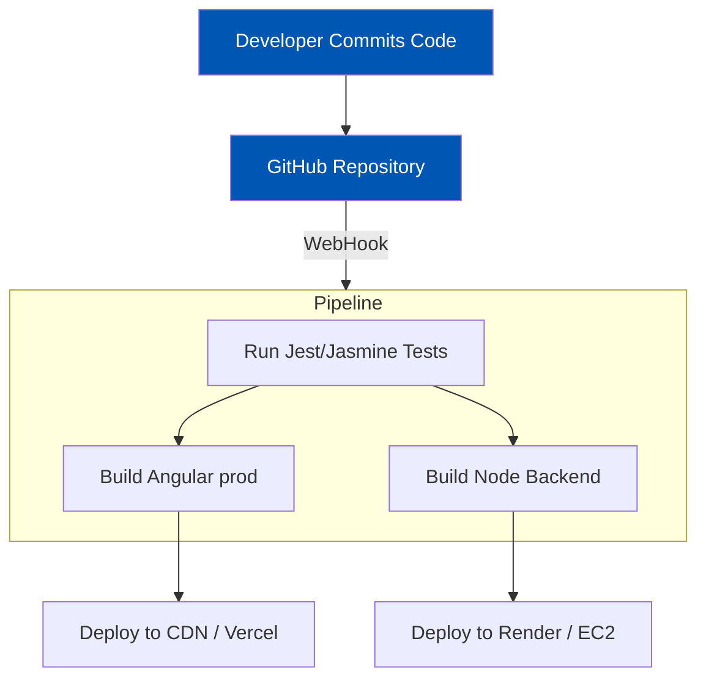

<h1>2. Comprehensive Technologies Used & Justifications</h1>

The technological foundation of the <strong>Mozhibu - Story</strong> platform is curated to achieve high performance, rapid horizontal scalability, and unparalleled developer ergonomics. By maintaining a strict JavaScript/TypeScript ecosystem across both the frontend and backend, the project benefits from shared paradigms, unified tooling, and an extensive open-source package ecosystem.

---

<h2>2.1 Frontend Technology Stack (Client-Side)</h2>

The frontend is a robust Single Page Application (SPA) utilizing modern reactive paradigms.

<table>
  <thead>
    <tr>
      <th>Core Technology</th>
      <th>Version</th>
      <th>Architectural Justification & Role</th>
    </tr>
  </thead>
  <tbody>
    <tr>
      <td>Angular</td>
      <td>v18.0.0+</td>
      <td>
        Chosen for its opinionated, enterprise-grade architecture. Angular's adoption of Standalone Components (`standalone: true`) drastically reduces boilerplate by eliminating `NgModules`. 
          <strong>Key Optimization:</strong> We heavily utilize Angular's new `Signals` API (`signal()`, `computed()`, `effect()`) for granular, Zone-free reactivity, drastically improving rendering performance when updating reading progress or coin balances.
      </td>
    </tr>
    <tr>
      <td>TypeScript</td>
      <td>v5.x</td>
      <td>
        Enforces strict typing across the vast data structures (User models, Book chapters, API responses). Prevents runtime errors during heavy refactoring. All services (like `ApiService`, `AuthService`) leverage generic typings.
      </td>
    </tr>
    <tr>
      <td>RxJS</td>
      <td>Native</td>
      <td>
        While Signals handle local state, RxJS is utilized for complex asynchronous streams (e.g., handling the `HttpClient` observable streams, debouncing search inputs in the Navbar, and combining API results using `forkJoin`).
      </td>
    </tr>
    <tr>
      <td>Google & Facebook SDKs</td>
      <td>Latest</td>
      <td>
        Google (`@abacritt/angularx-social-login`) and custom Facebook SDK logic are utilized to streamline user onboarding securely, bypassing traditional password fatigue.
      </td>
    </tr>
    <tr>
      <td>CSS3 & Custom Variables</td>
      <td>Vanilla</td>
      <td>
        We avoid heavy CSS frameworks (like Bootstrap) to minimize bundle size. The app relies on advanced CSS Grid/Flexbox layouts and heavily uses CSS Variables (`--ink`, `--surface`, etc.) to toggle the highly integrated <strong>Dark Mode</strong> seamlessly.
      </td>
    </tr>
  </tbody>
</table>

---

<h2>2.2 Backend Technology Stack (Server-Side)</h2>

The backend acts as the secure orchestrator and data gateway for the entire platform.

<table>
  <thead>
    <tr>
      <th>Core Technology</th>
      <th>Version</th>
      <th>Architectural Justification & Role</th>
    </tr>
  </thead>
  <tbody>
    <tr>
      <td>Node.js</td>
      <td>v18+ LTS</td>
      <td>
        The V8-powered runtime environment. The event-driven, non-blocking I/O model is uniquely suited for an application dealing with thousands of simultaneous read requests (e.g., users fetching book chapters concurrently).
      </td>
    </tr>
    <tr>
      <td>Express.js</td>
      <td>v4.x</td>
      <td>
        A minimalist web framework providing the routing logic, middleware chaining (for auth and error handling), and HTTP response formatting. Selected over NestJS for raw speed and minimal overhead.
      </td>
    </tr>
    <tr>
      <td>Mongoose</td>
      <td>v8.x</td>
      <td>
        The Object Data Modeling (ODM) library for MongoDB. Enforces strict schema validation at the application level, handles complex `populate()` calls to resolve relational links (like resolving Author details on a Book document), and provides robust middleware hooks.
      </td>
    </tr>
    <tr>
      <td>JSON Web Tokens (JWT)</td>
      <td>Standard</td>
      <td>
        Provides stateless authentication. Upon login, a JWT containing the user's ID and Role is signed using a highly secure `JWT_SECRET`. This token is passed via HTTP-only Cookies and the Authorization Bearer header.
      </td>
    </tr>
    <tr>
      <td>Bcrypt.js</td>
      <td>Native</td>
      <td>
        Used for computationally heavy password hashing to prevent brute-force and rainbow table attacks.
      </td>
    </tr>
  </tbody>
</table>

### Backend Security & Optimization Middleware

To ensure the Express API is resilient against attacks, we implement a robust middleware chain:

- **Helmet**: Secures Express apps by setting various HTTP headers (X-DNS-Prefetch-Control, X-Frame-Options).
- **Express-Rate-Limit**: Prevents DoS attacks by restricting the number of requests an IP can make to APIs like `/api/auth/login`.
- **Express-Mongo-Sanitize**: Strips out `$`, `.` from request payloads to prevent NoSQL injection attacks.

---

<h2>2.3 Database Tier (MongoDB)</h2>

MongoDB was chosen due to the highly variable nature of story data and the need for rapid read operations.

- **Document Structure**: Data is stored as BSON (Binary JSON), which maps perfectly to the JavaScript backend and frontend.
- **Atlas Cloud**: We utilize MongoDB Atlas for fully managed, multi-zone availability.
- **Indexing Strategy**: We utilize heavy indexing on fields frequently used in queries. For example, `Book.genre` and `Book.status` are indexed to ensure the trending/popular feeds load in under 10ms.

---

<h2>2.4 Cloud APIs & Third-Party Integrations</h2>

The platform achieves a "larger than life" feature set by integrating with powerful external services:

### 2.4.1 Google Gemini AI (Translation)
We utilize the `@google/generative-ai` package to provide real-time translation of story chapters. 
- **Workflow**: When a reader requests a chapter in a different language, the backend prompts the `gemini-1.5-flash` model to translate the text while strictly preserving HTML formatting and paragraph breaks. 
- **Reasoning**: Cheaper and significantly more context-aware for literary prose than traditional APIs like Google Translate.

### 2.4.2 Resend (Transactional Email)
We use the `resend` Node SDK for all outbound communications.
- **Workflow**: Used for sending OTPs, Password Reset links, and notifying Authors when their payout requests are approved.
- **Reasoning**: Extremely fast delivery, developer-friendly API, and excellent templating support.

### 2.4.3 Stripe (Payment Processing)
- **Workflow**: Readers purchase Coin packages or Subscriptions via Stripe Checkout. Webhooks listen for `checkout.session.completed` to update the user's `wallet.coins` or `subscription` status securely on the backend without trusting the client.
- **Reasoning**: Industry standard for secure, PCI-compliant payment handling.

### 2.4.4 Cloudinary (Media Hosting)
- **Workflow**: When an author uploads a book cover, the backend intercepts the `multer` buffer and pipes it directly to Cloudinary.
- **Reasoning**: Cloudinary provides on-the-fly image transformations (resizing, webp conversion), drastically reducing bandwidth costs and speeding up the Angular UI.

---

<h2>2.5 DevOps & Deployment Pipeline</h2>

While the application is currently capable of running locally via `npm run dev` and `npm start`, the production architecture is designed for modern cloud PaaS providers (like Render, Heroku, or Vercel).

By decoupling the frontend static assets (served via CDN) from the backend dynamic API (served via a Node instance), the platform can handle immense traffic spikes during major story releases.