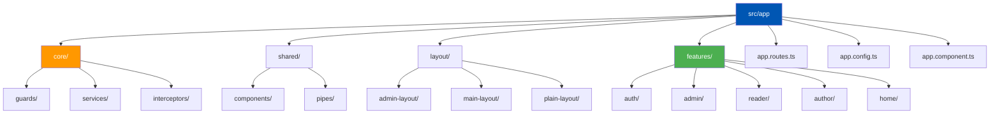
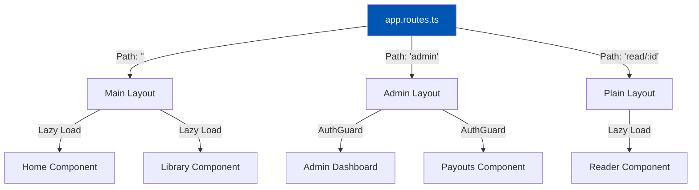

<h1>3. Frontend Architecture & Folder Structure</h1>

The Angular frontend (`/Frontend/src/app`) is architected using a strict <strong>Feature-Driven (or Domain-Driven) Architecture</strong>. This means that instead of organizing files strictly by their type (e.g., putting all components in one folder, all services in another), files are grouped by their business feature. This design choice drastically improves scalability, prevents "god folders" from growing unmanageable, and intrinsically supports aggressive Lazy Loading.

---

<h2>3.1 High-Level Directory Tree</h2>

Below is a detailed map of the `src/app` directory, illustrating the separation of concerns.

---

<h2>3.2 Core Module (`src/app/core/`)</h2>

The `core` directory is strictly reserved for singleton services, application-wide state management, and configuration logic that should only be instantiated **once** across the entire application lifecycle.

<table>
  <thead>
    <tr>
      <th>Category</th>
      <th>Detailed Responsibilities</th>
    </tr>
  </thead>
  <tbody>
    <tr>
      <td>Services (`/services`)</td>
      <td>
        <ul>
          <li><strong>`auth.service.ts`</strong>: Manages the global authentication state using Angular Signals (`user = signal<User | null>(null)`). Interacts with Google/Facebook SDKs and handles JWT storage in `localStorage`.</li>
          <li><strong>`api.service.ts`</strong>: A generic HTTP wrapper around Angular's `HttpClient`. It abstracts away base URLs and provides standardized error handling mechanisms.</li>
          <li><strong>`language.service.ts`</strong>: Manages the active localization state for the Gemini AI translator and UI translations.</li>
        </ul>
      </td>
    </tr>
    <tr>
      <td>Interceptors (`/interceptors`)</td>
      <td>
        <ul>
          <li><strong>`auth.interceptor.ts`</strong>: Intercepts every outgoing HTTP request. If a JWT token exists in `localStorage`, it clones the request and appends `Authorization: Bearer <token>`. If a `401 Unauthorized` response is caught, it triggers an automatic logout.</li>
        </ul>
      </td>
    </tr>
    <tr>
      <td>Guards (`/guards`)</td>
      <td>
        <ul>
          <li><strong>`auth.guard.ts`</strong>: Protects routes (like `/library` or `/admin`) from unauthenticated access.</li>
          <li><strong>`admin.guard.ts`</strong>: Decodes the JWT or checks the `user` signal to ensure the user has the `superadmin` role before allowing navigation to `/admin/*`.</li>
        </ul>
      </td>
    </tr>
  </tbody>
</table>

---

<h2>3.3 Shared Module (`src/app/shared/`)</h2>

The `shared` directory contains "dumb" or presentational components. These components should never inject core services (like `ApiService`). They should only receive data via `@Input()` and emit events via `@Output()`.

*   **`/components`**:
    *   `book-card.component.ts`: A highly reusable UI card displaying a book cover, title, and author. Used in Home, Library, and Search features.
    *   `user-card.component.ts`: Displays user avatars and follow buttons.
    *   `google-ad.component.ts`: Wraps the Google AdSense `<ins>` tag to safely render ads across different routes.
*   **`/pipes`**:
    *   `translate.pipe.ts`: Transforms keys like `'home.welcome'` into localized strings based on the `LanguageService`.
    *   `safe-html.pipe.ts`: Bypasses Angular's strict DOM sanitizer to render rich-text HTML (used heavily in the Chapter Reader).

---

<h2>3.4 Layouts (`src/app/layout/`)</h2>

Layouts act as structural shells. The Angular Router injects the active feature component into the layout's `<router-outlet>`.

1.  **`main-layout.component.ts`**: The standard shell containing the main Navbar (Search, Login, Library) and Footer. Used for almost all public and reader-facing pages.
2.  **`admin-layout.component.ts`**: A dedicated shell featuring a heavy left-hand sidebar for superadmin navigation (Users, Finance, Broadcasts) and a collapsed top bar.
3.  **`plain-layout.component.ts`**: A completely blank shell (no navbar, no footer) used exclusively for the distraction-free `ReaderComponent`.

---

<h2>3.5 Features Module (`src/app/features/`)</h2>

This is where the business logic lives. Each feature folder is self-contained.

<table>
  <thead>
    <tr>
      <th>Feature Domain</th>
      <th>Key Components & Workflows</th>
    </tr>
  </thead>
  <tbody>
    <tr>
      <td>/auth</td>
      <td>
        Contains `login`, `signup`, and `complete-profile` components. 
          <strong>Workflow:</strong> Uses ReactiveForms to validate inputs. If a user signs in with Google, but lacks a Date of Birth, they are redirected to `complete-profile` before being allowed into the main app.
      </td>
    </tr>
    <tr>
      <td>/reader</td>
      <td>
        The crown jewel of the platform. The `reader.component.ts` parses HTML chapters. 
          <strong>Advanced Logic:</strong> It calculates scroll percentage using `@HostListener('window:scroll')` to update a visual progress bar. It integrates with Gemini AI for inline translations.
      </td>
    </tr>
    <tr>
      <td>/admin</td>
      <td>
        A complex suite of sub-features.
        <ul>
            <li>`dashboard`: KPIs and charts.</li>
            <li>`payouts`: Approving financial withdrawals.</li>
            <li>`contact-queries`: A table view to read messages submitted via the public Contact Us page.</li>
        </ul>
      </td>
    </tr>
    <tr>
      <td>/home</td>
      <td>
        The landing page. It heavily utilizes `forkJoin` from RxJS to fetch multiple data streams concurrently (Trending, Popular, Editor's Picks) to minimize loading times.
      </td>
    </tr>
    <tr>
      <td>/my-reading</td>
      <td>
        The user's personal dashboard displaying their "Continue Reading" tracking, unlocked premium chapters, and followed authors.
      </td>
    </tr>
  </tbody>
</table>

---

<h2>3.6 Application Bootstrapping (`app.config.ts` & `app.routes.ts`)</h2>

Because the application uses Angular 18 Standalone components, there is no `app.module.ts`. 

### `app.config.ts`
This file configures the global providers. It sets up `provideHttpClient` (attaching the auth interceptor), `provideRouter` (enabling view transitions and scroll restoration), and initializes the `SocialAuthServiceConfig` with the environment-specific Google Client ID.

### `app.routes.ts` (Routing Flow)

Routing heavily utilizes lazy loading (`loadComponent`) to split the Javascript bundles.

