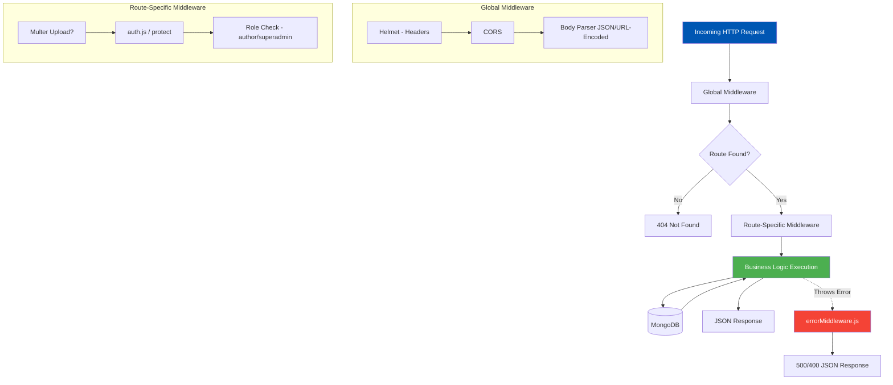

<h1>4. Backend Architecture & Middleware Chains</h1>

<p>
The Node.js (Express) backend (`/Backend/src`) follows a strict MVC (Model-View-Controller) derived pattern, tailored for REST API responses instead of View rendering. The architecture heavily relies on an extensive <strong>Middleware Chain</strong> that intercepts HTTP requests to perform authentication validation, role-based access control, file handling, and robust error handling before requests ever reach the core business logic.
</p>

---

<h2>4.1 The Core Backend Directory Structure</h2>

<table>
  <thead>
    <tr>
      <th>Directory</th>
      <th>Architectural Purpose & Responsibility</th>
    </tr>
  </thead>
  <tbody>
    <tr>
      <td>/models</td>
      <td>
        Mongoose Schema definitions. This is the single source of truth for the shape of the database. Contains `User.js`, `Book.js`, `Chapter.js`, `Settings.js`, etc. Heavy use of pre/post save hooks (e.g., auto-hashing passwords in the User model before saving).
      </td>
    </tr>
    <tr>
      <td>/routes</td>
      <td>
        The entry points for HTTP requests. Routes bind specific URL paths (e.g., `POST /api/books`) to a chain of Middlewares followed by the Controller logic.
      </td>
    </tr>
    <tr>
      <td>/middleware</td>
      <td>
        Reusable function blocks that execute sequentially. They modify the Request/Response objects or terminate the request early if conditions (like security) fail. 
      </td>
    </tr>
    <tr>
      <td>/controllers (Inline)</td>
      <td>
        Currently, much of the business logic is handled inline within the `routes` directory, leveraging `async/await` to process database operations directly after middleware verification.
      </td>
    </tr>
  </tbody>
</table>

---

<h2>4.2 Deep Dive: The Middleware Pipeline</h2>
<p>
When a client requests a sensitive resource (e.g., publishing a chapter), the request passes through a gauntlet of protective middlewares. Let's examine the request lifecycle.
</p>

### The Request Lifecycle Flowchart



### Detailed Middleware Roles

<table>
  <thead>
    <tr>
      <th>Middleware Component</th>
      <th>Execution Logic</th>
    </tr>
  </thead>
  <tbody>
    <tr>
      <td>1. `auth.js` (`protect`)</td>
      <td>
        Extracts the JWT from the `Authorization` header (`Bearer <token>`). Verifies the signature using the `JWT_SECRET`. If valid, decodes the user ID, fetches the user from MongoDB (excluding the password field), and attaches it to `req.user`. If invalid, missing, or expired, returns a strict `401 Unauthorized` with a `{ message: "Not authorized, token failed" }` response.
      </td>
    </tr>
    <tr>
      <td>2. `auth.js` (`author` role)</td>
      <td>
        A secondary gatekeeper run *after* `protect`. It checks if `req.user.role` equals `'author'` (or `'superadmin'`). Used for routes like `POST /api/books`. Returns `403 Forbidden` if the user is merely a reader.
      </td>
    </tr>
    <tr>
      <td>3. `auth.js` (`superadmin` role)</td>
      <td>
        The highest tier of access. Ensures `req.user.role === 'superadmin'`. Protects highly sensitive routes like `GET /api/admin/users`, `PUT /api/settings`, and Payout approvals.
      </td>
    </tr>
    <tr>
      <td>4. `multer` (Upload Config)</td>
      <td>
        Intercepts `multipart/form-data` requests (used heavily when uploading book covers). We configure Multer to use `storage: multer.memoryStorage()` so that the file buffer can be directly piped to Cloudinary without writing temporary files to the disk, maximizing I/O performance.
      </td>
    </tr>
    <tr>
      <td>5. `errorMiddleware.js` (Global)</td>
      <td>
        The final catch-all at the end of the Express stack. If any route throws an unhandled exception or calls `next(err)`, this middleware catches it. It scrubs stack traces in Production mode (for security), and sends a standardized JSON error response (`{ message: err.message, stack: ... }`) to the Angular frontend.
      </td>
    </tr>
  </tbody>
</table>

---

<h2>4.3 Core Route Definitions (`server.js`)</h2>

The middleware chains are ultimately connected in the `server.js` file, which acts as the main API router.

```javascript
// Express Application Bootstrapping (server.js snapshot)

app.use(cors());
app.use(express.json()); // Parses application/json
app.use(express.urlencoded({ extended: true }));

// Core Modules
app.use("/api/auth", authRoutes);       // Login, Signup, OAuth callbacks
app.use("/api/users", userRoutes);      // Profile updates, Wallet balances
app.use("/api/books", bookRoutes);      // Fetching books, Author publishing logic
app.use("/api/settings", settingsRoutes); // Dynamic configuration fetches

// Advanced Modules
app.use("/api/admin", adminRoutes);     // Admin charts, payout reviews
app.use("/api/contact", contactRoutes); // Public contact form submissions
app.use("/api/subscriptions", subscriptionRoutes); // Stripe subscription hooks
```

Every request routed through these paths is subjected to the middleware pipeline specific to that route file.