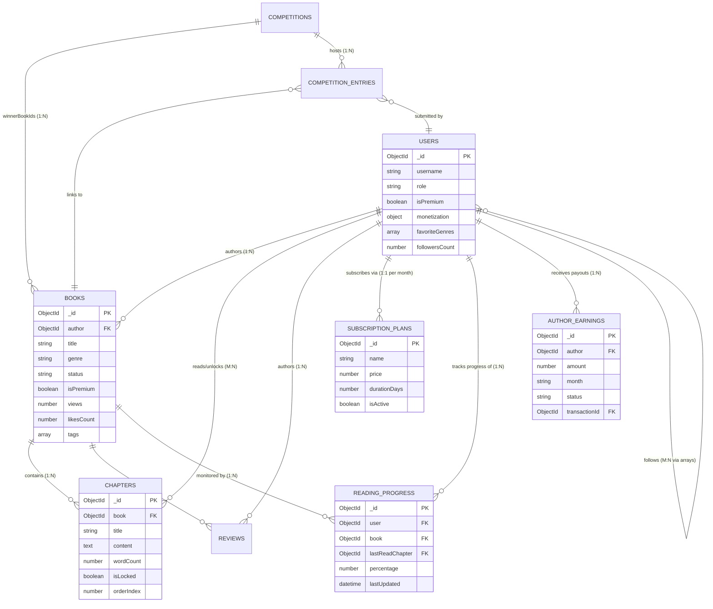

<h1 style="color: #0056b3; border-bottom: 2px solid #28a745; padding-bottom: 10px;">8. Exhaustive ER Diagram & Data Modeling Deep Dive</h1>

This section provides a granular, macroscopic look at the data architecture powering <strong>Mozhibu - Story</strong>. Unlike SQL, NoSQL requires careful consideration of access patterns to avoid devastating `$lookup` performance bottlenecks. Below is the master Entity Relationship diagram illustrating how the 20+ MongoDB collections interact via Mongoose `ObjectId` references, followed by a comprehensive breakdown of the core transactional models and their specific field constraints.

---

<h2 style="color: #28a745;">8.1 Comprehensive Collection Relationships (The Global Map)</h2>

---

<h2 style="color: #28a745;">8.2 Core Collections Deep Dive & Indexing Justifications</h2>

Each model below represents a Mongoose Schema. Field definitions are strict, utilizing Mongoose validation to reject dirty data before it reaches the MongoDB BSON serialization layer.

  <h3 style="color: #0056b3; margin-top: 0;">1. The `ReadingProgress` Collection (High-Velocity Writes)</h3>
  

    This is the most highly written-to collection in the entire database. It tracks exactly where a reader is within a book. It is crucial for two reasons: saving the user's place in the app, and calculating "Qualified Reads" which dictate complex author payouts.
  

  <ul style="color: #333; line-height: 1.6;">
    <li><strong>`user`</strong>: Reference to the User `ObjectId`. (Indexed)</li>
    <li><strong>`book`</strong>: Reference to the Book `ObjectId`. (Indexed)</li>
    <li><strong>`lastReadChapter`</strong>: Updates asynchronously via a debounced API call as the user scrolls through the frontend application.</li>
    <li><strong>`percentage`</strong>: Used by the UI to render visual progress bars (e.g., "75% complete") on the Reader's library page.</li>
    <li><strong>Compound Index:</strong> A unique compound index on `{ user: 1, book: 1 }` exists to ensure a single user can only have one progress tracker per book, triggering an `upsert` (Update or Insert) on the backend.</li>
  </ul>

  <h3 style="color: #28a745; margin-top: 0;">2. The `AuthorEarnings` Collection (Analytical / Batch Processing)</h3>
  

    Unlike the real-time `ReadingProgress`, this collection is populated via massive batch processing. It is calculated recursively by a Node.js Cron job running at the end of each month. It aggregates data from `ReadingProgress`, total `SubscriptionPlans` revenue pool, and active `MonthlyAdRevenue`.
  

  <ul style="color: #333; line-height: 1.6;">
    <li><strong>`author`</strong>: The User ID of the writer receiving the payout.</li>
    <li><strong>`amount`</strong>: The precise calculated total stored as an integer (in cents/paise) to completely avoid JavaScript floating-point rounding errors (e.g., storing `10050` instead of `$100.50`).</li>
    <li><strong>`status`</strong>: Enum (`calculated`, `pending_transfer`, `paid`, `failed`). This acts as a state machine for the payout workflow.</li>
    <li><strong>`month`</strong>: Stored as a string (e.g., "2026-09") for rapid historical dashboard queries.</li>
  </ul>

  <h3 style="color: #333; margin-top: 0;">3. The `User` Collection (The Central Hub)</h3>
  

    The `User` collection manages the authorization and personalization context for every session. Due to MongoDB's flexibility, it utilizes embedded sub-documents heavily.
  

  <ul style="color: #333; line-height: 1.6;">
    <li><strong>`role`</strong>: Enforces strict RBAC (`reader`, `writer`, `superadmin`).</li>
    <li><strong>`savedBooks` & `following`</strong>: Arrays of `ObjectIds`. Instead of a massive JOIN table to see who follows whom, MongoDB arrays allow for instant lookup. (e.g., `User.findById(id).populate('following')`).</li>
    <li><strong>`monetization`</strong>: An embedded sub-document (`accountName`, `accountNumber`). In Mongoose, these fields are marked with `select: false` so that a standard `User.findOne()` never accidentally returns sensitive bank details to the frontend unless explicitly requested via `.select('+monetization')`.</li>
  </ul>

