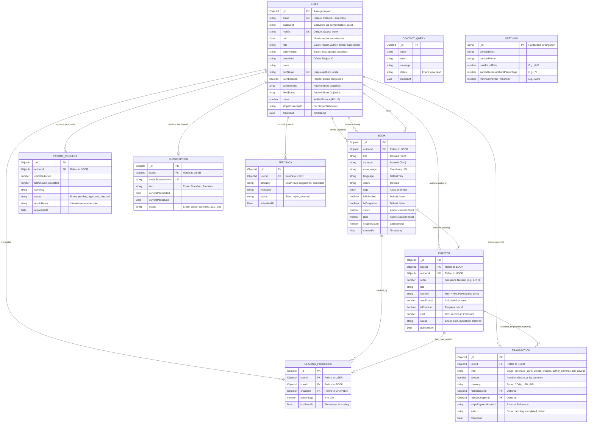

<h1>8. Comprehensive Entity Relationship Diagram (ERD)</h1>

<p>
While MongoDB is fundamentally a NoSQL, schema-less document database, the Mozhibu platform architecture strictly enforces SQL-like relational integrity at the application layer using <strong>Mongoose `ObjectId` references</strong>. Because of the sheer size and complexity of the platform (spanning Content, Monetization, Subscriptions, Governance, and User Analytics), the relational mapping is extensive. 
</p>
<p>
The following document provides an exhaustive, attribute-level mapping of every collection in the database, defining exactly how data intersects between the Reader, the Author, and the System.
</p>

---

<h2>8.1 Master System ER Diagram</h2>

The diagram below maps all major collections. Pay close attention to the multiplicity (e.g., `||--o{` indicates a One-to-Many relationship, `||--o|` indicates a One-to-One or Zero).



---

<h2>8.2 Relational Integrity & Mongoose Cascading Deletes</h2>
<p>
Because MongoDB does not natively support `ON DELETE CASCADE` constraints at the database engine level (unlike SQL), failing to clean up references results in "Orphaned Documents" and critical application errors (e.g., trying to read a Chapter whose parent Book no longer exists).
</p>
<p>
Mozhibu solves this by implementing rigorous <strong>Mongoose Pre-Remove Hooks</strong>. When an entity is deleted, Mongoose intercepts the deletion and recursively triggers `$deleteMany` and `$pull` operations on all child entities.
</p>

### The Cascade Deletion Flowchart

```mermaid
flowchart TD
    Trigger[Admin/User calls .remove() on Entity]
    
    Trigger --> IsUser{Is it a User?}
    IsUser -->|Yes| UserCascade
    
    subgraph User Deletion Cascade
        UserCascade[User.pre('remove')]
        UserCascade -->|Delete| DeleteBooks[Delete All Books where authorId = User._id]
        UserCascade -->|Delete| DeleteProgress[Delete All ReadingProgress for User]
        UserCascade -->|Delete| DeleteFeedback[Delete All Feedback for User]
        UserCascade -->|Nullify| NullifyPayouts[Set PayoutRequest.authorId = null (Keep for audits)]
    end
    
    DeleteBooks --> IsBook[Book Deletion Triggered]
    IsUser -->|No| CheckBook{Is it a Book?}
    CheckBook -->|Yes| IsBook
    
    subgraph Book Deletion Cascade
        IsBook[Book.pre('remove')]
        IsBook -->|Delete| DeleteChapters[Delete All Chapters where bookId = Book._id]
        IsBook -->|Delete| DeleteBookProgress[Delete All ReadingProgress where bookId = Book._id]
        IsBook -->|Pull Array| RemoveSaved[UpdateMany Users: $pull Book._id from savedBooks]
        IsBook -->|Pull Array| RemoveLiked[UpdateMany Users: $pull Book._id from likedBooks]
    end
    
    CheckBook -->|No| Done[Action Completed]
    DeleteChapters --> Done
    UserCascade --> Done
    
    style Trigger fill:#0056b3,color:#fff
    style UserCascade fill:#f44336,color:#fff
    style IsBook fill:#ff9800,color:#fff
    style Done fill:#4caf50,color:#fff
```

### Critical Implementation Note (Transactions)
Financial records (`Transactions`) are the **ONLY** entities in the database immune to cascading deletes. If a User is deleted, their `Transaction` ledger entries remain intact permanently. This is a strict requirement for financial compliance, tax auditing, and reconciling discrepancies with Stripe's external ledger. 

To handle this, when rendering an audit log, the application gracefully handles populated `userId` fields that return `null`, rendering them as "Deleted User" in the Admin Dashboard.