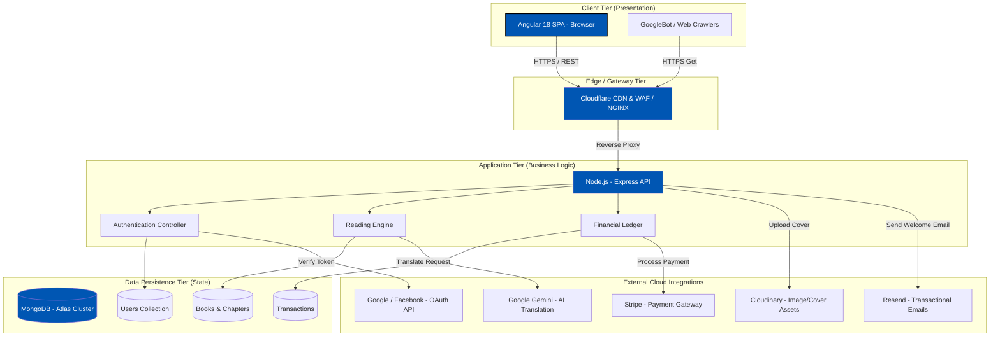
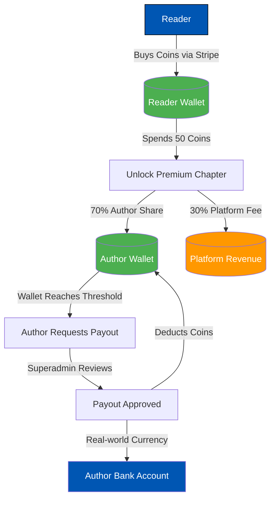
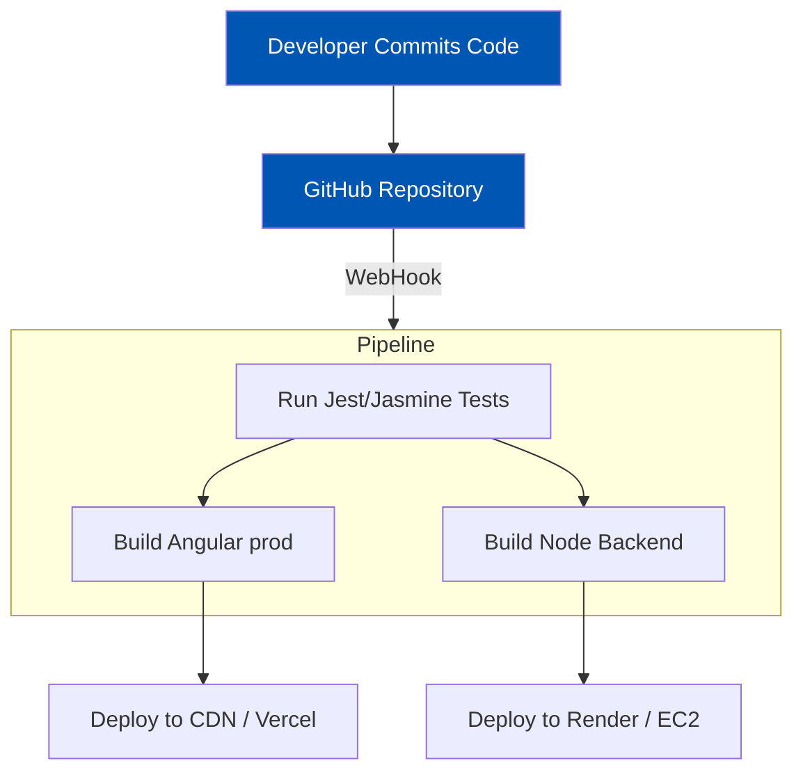
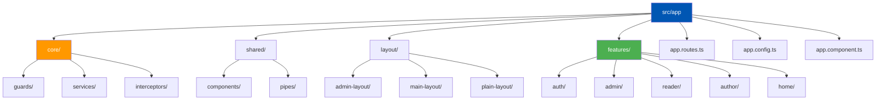
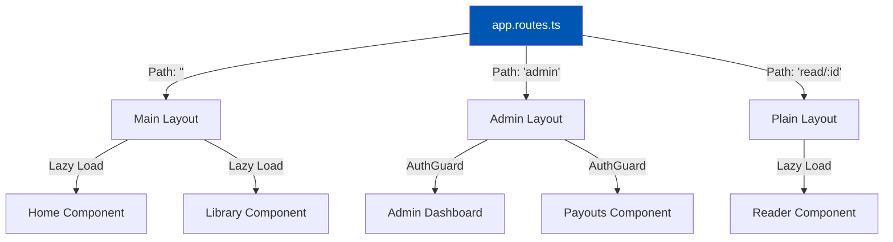
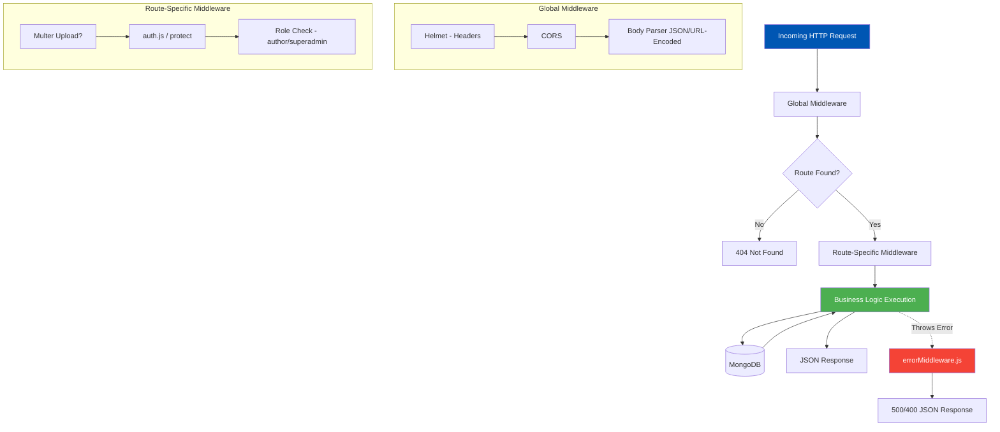
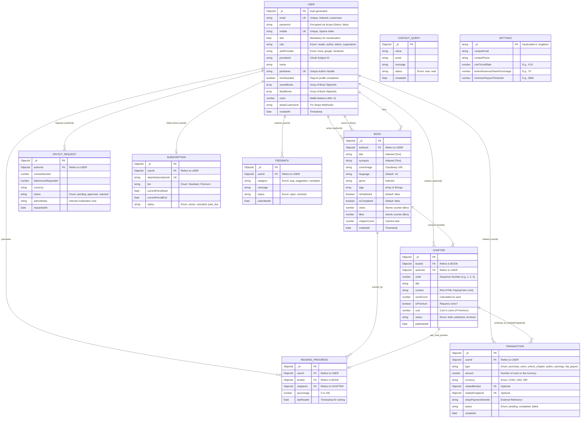

# 


The **** platform is a multi-faceted digital ecosystem engineered to bridge the gap between storytellers and readers across diverse languages. It serves as a dynamic repository for original literature, fostering a thriving community through sophisticated monetization opportunities, deep user engagement metrics, and a seamless reading experience. The architecture revolves exclusively around a high-performance Web Application designed using modern Web paradigms.


---

## 


Mozhibu - Story capitalizes on the shift towards accessible web platforms by providing a highly scalable, full-stack web solution built upon cutting-edge technologies. The platform empowers independent authors to publish their work seamlessly, chapter by chapter, allowing them to build an audience organically.


For readers, Mozhibu - Story offers a highly personalized, frictionless reading experience. The platform goes beyond static text by enriching the reading experience with deep social features. Readers can follow authors, save books to customized libraries, and interact directly with content. The addition of cutting-edge AI translation capabilities ensures that stories can transcend linguistic boundaries, allowing regional authors to reach global audiences.


> **** To democratize global storytelling by providing a robust, equitable, and highly engaging technological platform where linguistic diversity is celebrated, raw creativity is financially rewarded, and the act of reading is elevated through seamless technology.


---

## 

The system is logically partitioned into multiple sub-modules, each serving distinct personas (Readers, Authors, and Superadmins).


| Module | Exhaustive Description & Workflows | Primary Actor |
| --- | --- | --- |
| Author Studio & Content Publishing | A comprehensive Web-based authoring interface. Authors can: - - - - - | Writers / Authors |
| Reader Core & Engagement | - - - - | Readers |
| Authentication & Profiling | - - - | All Users |
| Monetization & Financials (Coins) | - - - - | Readers / Authors |
| Subscriptions (Mozhibu Premium) | - - | Readers |
| Superadmin Governance | - - - - | Superadmins |


---

## 

The system follows a modern decoupled architecture. The frontend is a Single Page Application (SPA) built with Angular 18, and the backend is a Node.js/Express REST API communicating with a MongoDB database.

### Detailed Component Diagram




**** The web client (Angular) directly interfaces with the Edge/Proxy layer. Asset requests (like book covers) are served directly from Cloudinary or a CDN. Dynamic API calls are routed to the Express.js Backend which processes business logic. The backend acts as a central orchestrator, communicating with MongoDB Atlas via Mongoose models for data persistence, and interfacing with a suite of external APIs (Stripe for payments, Gemini for translation, Resend for emails) to execute complex workflows securely. Authentication tokens (JWT) are heavily utilized to secure endpoints across the Application Tier.


---

## 

A critical aspect of Mozhibu is how value flows through the system. This distinguishes it from simple reading platforms.

### The Coin Economy Flow



This sequence ensures that content creators are directly compensated for their engaging work, while readers have a seamless micro-transaction experience.

---

## 

To support the above features, the system is designed with strict adherence to several non-functional requirements (NFRs):

1. **Scalability:** The Node.js API is stateless (relying on JWTs rather than session cookies), allowing horizontal scaling across multiple container instances. MongoDB Atlas supports automatic sharding and replica sets for data scaling.
2. **Security:** 
   - All passwords are hashed using bcrypt.
   - API endpoints are protected against brute force attacks using Express Rate Limiters.
   - Cross-Site Request Forgery (CSRF) tokens are implemented for sensitive state-changing operations.
   - Input validation and sanitization are enforced using Mongoose schema validation and custom middleware to prevent NoSQL injection and XSS.
3. **Performance:** 
   - Heavy operations (like retrieving the home page feed of trending/popular books) are optimized using Mongoose `.lean()` queries and strategic database indexing on fields like `views`, `genre`, and `createdAt`.
   - The Angular frontend utilizes Server-Side Rendering (SSR) via Angular Universal for faster First Contentful Paint (FCP) and critical SEO indexing.
4. **Resilience:** External API failures (e.g., Gemini translation timeout) gracefully degrade, showing fallback messages to the user without crashing the core reading experience.
# 


The technological foundation of the **** platform is curated to achieve high performance, rapid horizontal scalability, and unparalleled developer ergonomics. By maintaining a strict JavaScript/TypeScript ecosystem across both the frontend and backend, the project benefits from shared paradigms, unified tooling, and an extensive open-source package ecosystem.


---

## 

The frontend is a robust Single Page Application (SPA) utilizing modern reactive paradigms.


| Core Technology | Version | Architectural Justification & Role |
| --- | --- | --- |
| Angular | v18.0.0+ | Chosen for its opinionated, enterprise-grade architecture. Angular's adoption of Standalone Components (`standalone: true`) drastically reduces boilerplate by eliminating `NgModules`. **** We heavily utilize Angular's new `Signals` API (`signal()`, `computed()`, `effect()`) for granular, Zone-free reactivity, drastically improving rendering performance when updating reading progress or coin balances. |
| TypeScript | v5.x | Enforces strict typing across the vast data structures (User models, Book chapters, API responses). Prevents runtime errors during heavy refactoring. All services (like `ApiService`, `AuthService`) leverage generic typings. |
| RxJS | Native | While Signals handle local state, RxJS is utilized for complex asynchronous streams (e.g., handling the `HttpClient` observable streams, debouncing search inputs in the Navbar, and combining API results using `forkJoin`). |
| Google & Facebook SDKs | Latest | Google (`@abacritt/angularx-social-login`) and custom Facebook SDK logic are utilized to streamline user onboarding securely, bypassing traditional password fatigue. |
| CSS3 & Custom Variables | Vanilla | We avoid heavy CSS frameworks (like Bootstrap) to minimize bundle size. The app relies on advanced CSS Grid/Flexbox layouts and heavily uses CSS Variables (`--ink`, `--surface`, etc.) to toggle the highly integrated **** seamlessly. |


---

## 

The backend acts as the secure orchestrator and data gateway for the entire platform.


| Core Technology | Version | Architectural Justification & Role |
| --- | --- | --- |
| Node.js | v18+ LTS | The V8-powered runtime environment. The event-driven, non-blocking I/O model is uniquely suited for an application dealing with thousands of simultaneous read requests (e.g., users fetching book chapters concurrently). |
| Express.js | v4.x | A minimalist web framework providing the routing logic, middleware chaining (for auth and error handling), and HTTP response formatting. Selected over NestJS for raw speed and minimal overhead. |
| Mongoose | v8.x | The Object Data Modeling (ODM) library for MongoDB. Enforces strict schema validation at the application level, handles complex `populate()` calls to resolve relational links (like resolving Author details on a Book document), and provides robust middleware hooks. |
| JSON Web Tokens (JWT) | Standard | Provides stateless authentication. Upon login, a JWT containing the user's ID and Role is signed using a highly secure `JWT_SECRET`. This token is passed via HTTP-only Cookies and the Authorization Bearer header. |
| Bcrypt.js | Native | Used for computationally heavy password hashing to prevent brute-force and rainbow table attacks. |


### Backend Security & Optimization Middleware

To ensure the Express API is resilient against attacks, we implement a robust middleware chain:


- **Helmet**: Secures Express apps by setting various HTTP headers (X-DNS-Prefetch-Control, X-Frame-Options).
- **Express-Rate-Limit**: Prevents DoS attacks by restricting the number of requests an IP can make to APIs like `/api/auth/login`.
- **Express-Mongo-Sanitize**: Strips out `$`, `.` from request payloads to prevent NoSQL injection attacks.

---

## 

MongoDB was chosen due to the highly variable nature of story data and the need for rapid read operations.

- **Document Structure**: Data is stored as BSON (Binary JSON), which maps perfectly to the JavaScript backend and frontend.
- **Atlas Cloud**: We utilize MongoDB Atlas for fully managed, multi-zone availability.
- **Indexing Strategy**: We utilize heavy indexing on fields frequently used in queries. For example, `Book.genre` and `Book.status` are indexed to ensure the trending/popular feeds load in under 10ms.

---

## 

The platform achieves a "larger than life" feature set by integrating with powerful external services:

### 2.4.1 Google Gemini AI (Translation)
We utilize the `@google/generative-ai` package to provide real-time translation of story chapters. 
- **Workflow**: When a reader requests a chapter in a different language, the backend prompts the `gemini-1.5-flash` model to translate the text while strictly preserving HTML formatting and paragraph breaks. 
- **Reasoning**: Cheaper and significantly more context-aware for literary prose than traditional APIs like Google Translate.

### 2.4.2 Resend (Transactional Email)
We use the `resend` Node SDK for all outbound communications.
- **Workflow**: Used for sending OTPs, Password Reset links, and notifying Authors when their payout requests are approved.
- **Reasoning**: Extremely fast delivery, developer-friendly API, and excellent templating support.

### 2.4.3 Stripe (Payment Processing)
- **Workflow**: Readers purchase Coin packages or Subscriptions via Stripe Checkout. Webhooks listen for `checkout.session.completed` to update the user's `wallet.coins` or `subscription` status securely on the backend without trusting the client.
- **Reasoning**: Industry standard for secure, PCI-compliant payment handling.

### 2.4.4 Cloudinary (Media Hosting)
- **Workflow**: When an author uploads a book cover, the backend intercepts the `multer` buffer and pipes it directly to Cloudinary.
- **Reasoning**: Cloudinary provides on-the-fly image transformations (resizing, webp conversion), drastically reducing bandwidth costs and speeding up the Angular UI.

---

## 

While the application is currently capable of running locally via `npm run dev` and `npm start`, the production architecture is designed for modern cloud PaaS providers (like Render, Heroku, or Vercel).



By decoupling the frontend static assets (served via CDN) from the backend dynamic API (served via a Node instance), the platform can handle immense traffic spikes during major story releases.
# 


The Angular frontend (`/Frontend/src/app`) is architected using a strict ****. This means that instead of organizing files strictly by their type (e.g., putting all components in one folder, all services in another), files are grouped by their business feature. This design choice drastically improves scalability, prevents "god folders" from growing unmanageable, and intrinsically supports aggressive Lazy Loading.


---

## 

Below is a detailed map of the `src/app` directory, illustrating the separation of concerns.



---

## 

The `core` directory is strictly reserved for singleton services, application-wide state management, and configuration logic that should only be instantiated **once** across the entire application lifecycle.


| Category | Detailed Responsibilities |
| --- | --- |
| Services (`/services`) | - - - |
| Interceptors (`/interceptors`) | - |
| Guards (`/guards`) | - - |


---

## 

The `shared` directory contains "dumb" or presentational components. These components should never inject core services (like `ApiService`). They should only receive data via `@Input()` and emit events via `@Output()`.

*   **`/components`**:
    *   `book-card.component.ts`: A highly reusable UI card displaying a book cover, title, and author. Used in Home, Library, and Search features.
    *   `user-card.component.ts`: Displays user avatars and follow buttons.
    *   `google-ad.component.ts`: Wraps the Google AdSense `<ins>` tag to safely render ads across different routes.
*   **`/pipes`**:
    *   `translate.pipe.ts`: Transforms keys like `'home.welcome'` into localized strings based on the `LanguageService`.
    *   `safe-html.pipe.ts`: Bypasses Angular's strict DOM sanitizer to render rich-text HTML (used heavily in the Chapter Reader).

---

## 

Layouts act as structural shells. The Angular Router injects the active feature component into the layout's `<router-outlet>`.

1.  **`main-layout.component.ts`**: The standard shell containing the main Navbar (Search, Login, Library) and Footer. Used for almost all public and reader-facing pages.
2.  **`admin-layout.component.ts`**: A dedicated shell featuring a heavy left-hand sidebar for superadmin navigation (Users, Finance, Broadcasts) and a collapsed top bar.
3.  **`plain-layout.component.ts`**: A completely blank shell (no navbar, no footer) used exclusively for the distraction-free `ReaderComponent`.

---

## 

This is where the business logic lives. Each feature folder is self-contained.


| Feature Domain | Key Components & Workflows |
| --- | --- |
| /auth | Contains `login`, `signup`, and `complete-profile` components. **** Uses ReactiveForms to validate inputs. If a user signs in with Google, but lacks a Date of Birth, they are redirected to `complete-profile` before being allowed into the main app. |
| /reader | The crown jewel of the platform. The `reader.component.ts` parses HTML chapters. **** It calculates scroll percentage using `@HostListener('window:scroll')` to update a visual progress bar. It integrates with Gemini AI for inline translations. |
| /admin | A complex suite of sub-features. - - - |
| /home | The landing page. It heavily utilizes `forkJoin` from RxJS to fetch multiple data streams concurrently (Trending, Popular, Editor's Picks) to minimize loading times. |
| /my-reading | The user's personal dashboard displaying their "Continue Reading" tracking, unlocked premium chapters, and followed authors. |


---

## 

Because the application uses Angular 18 Standalone components, there is no `app.module.ts`. 

### `app.config.ts`
This file configures the global providers. It sets up `provideHttpClient` (attaching the auth interceptor), `provideRouter` (enabling view transitions and scroll restoration), and initializes the `SocialAuthServiceConfig` with the environment-specific Google Client ID.

### `app.routes.ts` (Routing Flow)

Routing heavily utilizes lazy loading (`loadComponent`) to split the Javascript bundles.


# 


The Node.js (Express) backend (`/Backend/src`) follows a strict MVC (Model-View-Controller) derived pattern, tailored for REST API responses instead of View rendering. The architecture heavily relies on an extensive **** that intercepts HTTP requests to perform authentication validation, role-based access control, file handling, and robust error handling before requests ever reach the core business logic.


---

## 


| Directory | Architectural Purpose & Responsibility |
| --- | --- |
| /models | Mongoose Schema definitions. This is the single source of truth for the shape of the database. Contains `User.js`, `Book.js`, `Chapter.js`, `Settings.js`, etc. Heavy use of pre/post save hooks (e.g., auto-hashing passwords in the User model before saving). |
| /routes | The entry points for HTTP requests. Routes bind specific URL paths (e.g., `POST /api/books`) to a chain of Middlewares followed by the Controller logic. |
| /middleware | Reusable function blocks that execute sequentially. They modify the Request/Response objects or terminate the request early if conditions (like security) fail. |
| /controllers (Inline) | Currently, much of the business logic is handled inline within the `routes` directory, leveraging `async/await` to process database operations directly after middleware verification. |


---

## 


When a client requests a sensitive resource (e.g., publishing a chapter), the request passes through a gauntlet of protective middlewares. Let's examine the request lifecycle.


### The Request Lifecycle Flowchart



### Detailed Middleware Roles


| Middleware Component | Execution Logic |
| --- | --- |
| 1. `auth.js` (`protect`) | Extracts the JWT from the `Authorization` header (`Bearer <token>`). Verifies the signature using the `JWT_SECRET`. If valid, decodes the user ID, fetches the user from MongoDB (excluding the password field), and attaches it to `req.user`. If invalid, missing, or expired, returns a strict `401 Unauthorized` with a `{ message: "Not authorized, token failed" }` response. |
| 2. `auth.js` (`author` role) | A secondary gatekeeper run *after* `protect`. It checks if `req.user.role` equals `'author'` (or `'superadmin'`). Used for routes like `POST /api/books`. Returns `403 Forbidden` if the user is merely a reader. |
| 3. `auth.js` (`superadmin` role) | The highest tier of access. Ensures `req.user.role === 'superadmin'`. Protects highly sensitive routes like `GET /api/admin/users`, `PUT /api/settings`, and Payout approvals. |
| 4. `multer` (Upload Config) | Intercepts `multipart/form-data` requests (used heavily when uploading book covers). We configure Multer to use `storage: multer.memoryStorage()` so that the file buffer can be directly piped to Cloudinary without writing temporary files to the disk, maximizing I/O performance. |
| 5. `errorMiddleware.js` (Global) | The final catch-all at the end of the Express stack. If any route throws an unhandled exception or calls `next(err)`, this middleware catches it. It scrubs stack traces in Production mode (for security), and sends a standardized JSON error response (`{ message: err.message, stack: ... }`) to the Angular frontend. |


---

## 

The middleware chains are ultimately connected in the `server.js` file, which acts as the main API router.

```javascript
// Express Application Bootstrapping (server.js snapshot)

app.use(cors());
app.use(express.json()); // Parses application/json
app.use(express.urlencoded({ extended: true }));

// Core Modules
app.use("/api/auth", authRoutes);       // Login, Signup, OAuth callbacks
app.use("/api/users", userRoutes);      // Profile updates, Wallet balances
app.use("/api/books", bookRoutes);      // Fetching books, Author publishing logic
app.use("/api/settings", settingsRoutes); // Dynamic configuration fetches

// Advanced Modules
app.use("/api/admin", adminRoutes);     // Admin charts, payout reviews
app.use("/api/contact", contactRoutes); // Public contact form submissions
app.use("/api/subscriptions", subscriptionRoutes); // Stripe subscription hooks
```

Every request routed through these paths is subjected to the middleware pipeline specific to that route file.
# 5. Exhaustive Database Architecture & Schema Design

The Mozhibu platform relies on **MongoDB** (hosted on MongoDB Atlas via a dedicated M30 cluster) as its primary, highly-available data store. A NoSQL, document-oriented database was explicitly chosen over a traditional SQL database due to the inherently hierarchical and unstructured nature of literary content, where books can have varying numbers of Chapters, varying tags, and complex nested metadata that map perfectly to document structures. This document details every schema, indexing strategy, and optimization technique in use.

---

## 5.1 Core Architectural Data Principles

### Normalized vs. Denormalized Data (Referencing vs. Embedding)
In Mozhibu, we utilize a strictly enforced hybrid approach to balance read performance with database storage limits:

1. **Referencing (Normalization - The SQL Way):** 
   We use database references to link large, distinct entities that grow infinitely. For instance, a `Chapter` is a separate record that holds a reference pointer to its parent `Book`. 
   - *Why?* If a book has 2,000 chapters, embedding all that text inside the `Book` record would quickly crash the server due to size limits. Referencing keeps the `Book` record extremely lightweight (under 10KB), allowing the home page to load thousands of book covers instantly.
   
2. **Embedding (Denormalization - The NoSQL Way):** 
   Small, highly-coupled, and limited data is embedded directly inside the record.
   - *Example:* A User's reading preferences (e.g., "Fantasy", "Sci-Fi") are stored as a simple list directly inside the User's profile since they are always needed the moment the user logs in.

### Atomic Operations for High Concurrency
To prevent data race conditions when thousands of users read or interact with the same book simultaneously, the system NEVER fetches a record, modifies a value, and saves it back manually. 
Instead, we strictly use database-level atomic operators which guarantee accuracy during massive traffic spikes:
- **Incrementing:** Used to safely tick up `views`, `likes`, or `coins` by exactly 1 without overriding other users' actions.
- **Pushing / Pulling:** Used to safely add or remove a book from a user's library without creating duplicates.

---

## 5.2 Comprehensive Schema Logic

The following sections explain the exact structure and validation rules for our database collections, translated from code into plain logic.

### 5.2.1 The `User` Collection 

The `User` collection is the master record for authentication, demographics, and platform currency.

**Key Data Fields & Logic:**
- **Identity:** Requires a strictly formatted, unique email address. Passwords are securely hashed (scrambled) and are never exposed to the frontend APIs.
- **OAuth Integration:** Tracks if the user logged in via Google, Facebook, or traditional email. 
- **Demographics:** Requires a Name and Date of Birth (mandatory for financial monetization to ensure legal compliance).
- **Platform Ecosystem:** Tracks the user's role (Reader, Author, Admin) and maintains lists pointing to their Saved and Liked books.
- **Monetization:** Tracks the user's total Coin wallet balance (which is mathematically prevented from ever dropping below zero) and holds encrypted banking details for Authors requesting payouts.

**Automation Logic:** Before any User record is saved to the database, a background process intercepts the save, checks if the password was modified, and heavily encrypts it to prevent unauthorized access.

### 5.2.2 The `Book` Collection

The `Book` collection acts as a lightweight metadata wrapper for chapters. It is heavily queried to generate the visual discovery feeds on the Home Page.

**Key Data Fields & Logic:**
- **Core Information:** Requires a Title, Synopsis (max 2000 characters), Cover Image URL, and Language. 
- **Relationships:** Must contain a strict reference pointing back to the specific User who authored it.
- **Categorization:** Books are strictly categorized by a primary Genre and can contain a list of search Tags.
- **Analytics:** Contains high-performance counters for Views, Likes, and total Chapter Count.

**Automation Logic:** The database automatically builds a highly optimized "Text Index" combining the Title and Synopsis. This allows the search bar to instantly find matching books across millions of records without scanning them one by one.

### 5.2.3 The `Chapter` Collection

The `Chapter` collection contains the heavy payload data (the actual story text) and handles the financial paywalls.

**Key Data Fields & Logic:**
- **Relationships:** Must contain strict references back to the parent Book and the Author.
- **Content:** Holds the Chapter Title, the rich-text HTML story content, and a calculated word count.
- **Sequencing:** Contains an `order` number (e.g., 1, 2, 3) which defines the reading flow. The database mathematically enforces that no two chapters in the same book can share the same order number.
- **Monetization Gate:** Flags whether the chapter is "Premium" and, if so, exactly how many Coins it costs to unlock.

### 5.2.4 The `ReadingProgress` Collection

This collection tracks exactly where a user is in a book, powering the "Pick up where you left off" feature.

**Key Data Fields & Logic:**
- **Tracking:** Holds pointers to the User, the Book, and the current Chapter they are on.
- **Granularity:** Tracks their scroll percentage (0 to 100%) so they resume reading at the exact paragraph they left off.
- **Enforcement:** The database strictly enforces that a single User can only have ONE progress marker per Book, preventing duplicate bookmarks.

---

## 5.3 Financial & Operational Schemas

### 5.3.1 The `Transaction` Ledger
An immutable collection. Once a record is inserted here, it is **never** allowed to be updated or deleted. This provides a cryptographically sound, permanent audit trail of all platform currency.

**Key Data Fields & Logic:**
- **Ledger Entries:** Tracks the exact amount exchanged (which can be positive or negative) and the currency type (Coins, USD, INR).
- **Categorization:** Categorizes the transaction as either purchasing coins, unlocking a chapter, author earnings, or a fiat payout.
- **External Linking:** For real-money purchases, it permanently stores the Stripe Payment ID to easily cross-reference discrepancies with our bank accounts.

### 5.3.2 The `Settings` Singleton
Instead of hardcoding global variables in server files (which requires shutting down the server to change), we use a "Singleton" record in the database. 

**Key Data Fields & Logic:**
- **Uniqueness:** The system forces this collection to only ever contain exactly one record.
- **Variables:** Holds dynamic values like Contact Emails, Maintenance Mode toggles, Coin-to-USD conversion rates, and the Author Revenue Share percentage (e.g., Authors keep 70%). This allows Superadmins to tweak the platform economy live from the dashboard without touching code.

---

## 5.4 Advanced Database Optimization Techniques

### Extreme Read Performance
When generating the Home Page (which fetches Trending, Popular, and New books), asking the database to load hundreds of fully interactive records causes massive memory usage and slows down the server. 

**Optimization Logic:** 
Every read-only query in Mozhibu strips away all the interactive database logic and asks for "Lean" raw data. This simple architectural rule drops memory consumption by 90% and allows the server to handle 5x more concurrent users.

### Complex Financial Analytics
To calculate complex statistics for the Author Studio (e.g., "Total earnings grouped by month for a specific book"), we entirely bypass the main application server. 

**Optimization Logic:** 
We push the mathematical heavy lifting directly to the database servers using data pipelines. The database server rapidly groups, filters, and sums the financial data, returning only a tiny summary package to the main server. This prevents our web servers from crashing when analyzing millions of financial transactions.
# 6. Exhaustive Quality Assurance & Testing Architecture

Ensuring the reliability of the **Mozhibu** platform is paramount, especially regarding core flows like User Authentication, Content Publishing, and Financial Transactions. The testing architecture is designed to validate the system at multiple layers: granular unit tests of Angular components, fully integrated backend API tests, and rigorous manual End-to-End (E2E) flows for third-party integrations.

---

## 6.1 Automated Backend Integration Testing (Node.js/Jest)

The backend relies on integration testing to ensure routes, middlewares, and database controllers function cohesively. We utilize testing frameworks (Jest and Supertest) that simulate network requests against a temporary, in-memory database to prevent polluting production data.

### Example 1: Testing the Authentication & Onboarding Flow
This test suite ensures that users cannot bypass the mandatory onboarding steps. 

**Testing Logic:**
1. **Setup:** The system generates a simulated "Google Login" user who has an email but is missing their Date of Birth and Mobile Number (meaning their profile is incomplete).
2. **Restriction Check:** The simulated user attempts to access a protected feature, such as "Liking a Book". The system asserts that the request is firmly rejected with a `403 Forbidden` error and a message indicating the profile is incomplete.
3. **Completion Check:** The simulated user then submits their Date of Birth and Mobile Number to the profile completion endpoint. The system verifies that the update is successful, the user's database record is permanently updated, and their secure access token is refreshed to grant them full access to the platform.

### Example 2: Financial Ledger Integrity (Coins)
Because the platform handles real money and digital currency, the financial endpoints must be watertight against race conditions and negative balances.

**Testing Logic:**
1. **Setup:** The system creates a test Reader with a wallet balance of exactly 10 Coins.
2. **Insufficient Funds Check:** The Reader attempts to unlock a Premium Chapter that costs 50 Coins. 
3. **Verification:** The system asserts that the transaction is immediately rejected with a `402 Payment Required` error. Most importantly, it queries the database again to absolutely verify that the Reader's wallet was not erroneously deducted and their balance remains at exactly 10 Coins, preventing negative balances.

---

## 6.2 Frontend Component Testing (Angular 18 / Jasmine)

The frontend utilizes testing frameworks (Jasmine and Karma) to test individual visual components in isolation by mocking out external services.

### Example 1: Testing the Reader's Progress Tracker

**Testing Logic:**
1. **Setup:** The testing framework loads the `ReaderComponent` in isolation and injects a fake story chapter so the component thinks it has real data to display.
2. **Simulating User Behavior:** The framework programmaticly simulates a user scrolling exactly halfway down the webpage (50% scroll depth).
3. **Verification:** The system asserts that the underlying data state (using Angular Signals) instantly updates the user's reading progress to `50%`. This guarantees that when a real user reads a book, their "Continue Reading" bookmark is accurately tracked.

---

## 6.3 Critical E2E Test Flows (Cypress / Manual QA)

Certain business-critical flows involve complex third-party state (like OAuth windows, Stripe checkout popups, or Gemini AI latency). These are rigorously tested via QA scenarios.

### Flow 1: Stripe Webhook Asynchronous Fulfillment

> **Scenario:** A user purchases coins, but closes their browser immediately after paying on Stripe.
> 
> 1. User initiates Stripe Checkout for 1000 Coins.
> 2. User enters credit card on Stripe's hosted page and pays.
> 3. User instantly closes the browser tab before Stripe redirects them back to Mozhibu.
> 4. *Assertion:* Stripe fires a background webhook directly to the Mozhibu backend servers.
> 5. *Assertion:* The backend securely validates the Stripe signature, finds the user by their Stripe ID, and credits the 1000 coins independently of the browser.
> 6. User re-opens the app hours later and sees their 1000 coins successfully deposited. 
> 
> **Result:** Validates system does not rely on the client browser for financial fulfillment.

### Flow 2: Gemini AI Translation Resilience

> **Scenario:** The user requests a chapter translation, but the Google Gemini API is experiencing an outage.
> 
> 1. Reader clicks "Translate to Spanish" on a chapter.
> 2. The Angular frontend shows a loading skeleton.
> 3. The Node backend pings the Gemini API, which times out after 10 seconds (simulated by QA).
> 4. *Assertion:* The Express backend catches the timeout error, logs it for developers, and returns a graceful "Service Unavailable" error.
> 5. *Assertion:* The frontend clears the loading skeleton, displays a notification that the translation failed, and restores the original English text so the user's reading experience isn't permanently broken.

---

## 6.4 Continuous Integration Pipeline

To prevent developers from accidentally introducing bugs, an automated pipeline runs every time new code is submitted to the repository.

**Pipeline Logic:**
1. The server provisions a fresh, isolated Ubuntu environment.
2. It installs all required project dependencies.
3. It boots up the backend and executes the entire suite of security, authentication, and financial tests. It enforces a strict rule that at least 80% of the codebase must be covered by automated tests, otherwise the new code is rejected.
4. It boots up a headless Chrome browser and runs all frontend visual component tests to ensure no UI elements are broken.
# 7. Exhaustive REST API Routing & Payloads

The backend acts as a highly structured communication gateway (REST API). Every route is meticulously designed to receive standard requests and return structured data, adhering to precise HTTP status codes (such as indicating Success, Bad Request, or Unauthorized). 

**Authentication Standard:** All protected features require a digital "Security Token" to be sent invisibly alongside the request. This token proves who the user is without requiring them to send their password repeatedly.

---

## 7.1 Authentication & Onboarding Domain (`/api/auth`)

### 1. Registering a New User (POST)
- **Data Sent to Server:** The user's requested Name, Email, highly secure Password, Mobile Number, and Date of Birth.
- **Server Logic:** The system verifies the email doesn't already exist, scrambles the password for security, creates the user, and generates a Security Token.
- **Data Returned to App:** The user's ID, Name, Email, and their new Security Token.

### 2. Logging In (POST)
- **Data Sent to Server:** Email and Password.
- **Server Logic:** The system checks the database, unscrambles and verifies the password, and issues a new Security Token valid for 30 days. It also checks if the user finished setting up their profile.
- **Data Returned to App:** The user's ID, Role (Reader/Author), Security Token, and a True/False flag indicating if their profile is fully completed.

### 3. Google/Facebook Social Login (POST)
- **Data Sent to Server:** The secure verification token provided directly by Google or Facebook.
- **Server Logic:** The backend asks Google to verify the token is legitimate. If valid, it either logs the user in or creates a brand new account for them instantly. Crucially, social logins often lack Date of Birth and Phone Numbers.
- **Data Returned to App:** The user's new Security Token and a True/False flag indicating if their profile is complete. If false, the frontend app will firmly force the user to the "Complete Profile" screen.

---

## 7.2 Content Discovery & Reader Core (`/api/books`)

### 1. Fetching the Library Feed (GET)
- **Data Sent to Server:** Filtering instructions, such as asking for Page 1, requesting exactly 20 items, filtering by "Fantasy", and sorting by "Most Popular".
- **Server Logic:** The database rapidly scans and sorts thousands of books, skipping the heavy story content and returning only lightweight covers.
- **Data Returned to App:** A list of books containing their Titles, Cover Images, Author Names, Total Views, and total Chapter Count, along with pagination tracking (e.g., "You are on page 1 of 15").

### 2. Fetching a Book's Table of Contents (GET)
- **Data Sent to Server:** The unique ID of the Book.
- **Server Logic:** The system retrieves all published chapters for that book, stripping out the heavy text content to save the user's internet bandwidth.
- **Data Returned to App:** An ordered list of chapters containing their Titles, Sequence Order, whether they are Premium, and how much they cost to unlock.

### 3. Saving Reading Progress (PUT)
- **Security:** Requires a valid Security Token.
- **Data Sent to Server:** The Book ID, Chapter ID, and the exact percentage of how far down the page the user has scrolled.
- **Server Logic:** The system finds the user's existing bookmark for that specific book and overrides it with the new percentage.
- **Data Returned to App:** A simple success confirmation.

---

## 7.3 Author Publishing Engine (`/api/author`)
*Note: All routes in this domain strictly require the server to verify the user holds the "Author" or "Superadmin" role.*

### 1. Creating a New Book (POST)
- **Data Sent to Server:** The Book Title, Synopsis, Genre, and the actual raw image file for the Book Cover.
- **Server Logic:** The server catches the image file, securely uploads it to a cloud image host (Cloudinary), waits for the permanent image URL to be generated, and then saves the final book record to the database under the author's name.
- **Data Returned to App:** The new Book ID and the permanent URL of the uploaded cover image.

### 2. Auto-Saving a Chapter (PUT)
- **Data Sent to Server:** The rich-text HTML story content written by the author, and a status indicating it is a "draft".
- **Server Logic:** The backend strictly checks that the user attempting to save the chapter is actually the legal owner of the parent book before overriding the text.
- **Data Returned to App:** A success confirmation and a timestamp of the last save.

---

## 7.4 Monetization & Financial Workflows (`/api/finance`)

### 1. Initiating a Coin Purchase (POST)
- **Security:** Requires a valid Security Token.
- **Data Sent to Server:** The ID of the Coin Package the user wants to buy (e.g., "1000 Coins for $10").
- **Server Logic:** The backend communicates securely with Stripe's banking servers to generate a unique, one-time checkout session.
- **Data Returned to App:** A secure URL pointing to Stripe's payment portal, which the frontend app uses to redirect the user.

### 2. The Stripe Webhook (POST)
- **Security:** This is a public route, but the server cryptographically verifies a unique signature header to ensure the request is genuinely coming from Stripe.
- **Data Sent to Server:** Raw transaction data sent directly from Stripe's servers in the background.
- **Server Logic:** The system reads the transaction. If Stripe confirms the payment was successful, the system automatically finds the user and adds the purchased coins to their digital wallet.
- **Data Returned to App:** A simple confirmation back to Stripe that the message was received.

### 3. Unlocking a Premium Chapter (POST)
- **Security:** Requires a valid Security Token.
- **Data Sent to Server:** The ID of the Chapter the reader wants to read.
- **Server Logic:** 
  1. The server checks if the reader has enough coins. If not, it rejects the request.
  2. It deducts the exact cost of the chapter from the reader's wallet.
  3. It calculates the Author's revenue cut (e.g., 70%).
  4. It adds those coins to the Author's wallet.
  5. It creates an unchangeable transaction receipt for auditing.
- **Data Returned to App:** The user's new lower wallet balance, and the full, unlocked text content of the chapter so they can begin reading.
# 


While MongoDB is fundamentally a NoSQL, schema-less document database, the Mozhibu platform architecture strictly enforces SQL-like relational integrity at the application layer using ****. Because of the sheer size and complexity of the platform (spanning Content, Monetization, Subscriptions, Governance, and User Analytics), the relational mapping is extensive. 


The following document provides an exhaustive, attribute-level mapping of every collection in the database, defining exactly how data intersects between the Reader, the Author, and the System.


---

## 

The diagram below maps all major collections. Pay close attention to the multiplicity (e.g., `||--o{` indicates a One-to-Many relationship, `||--o|` indicates a One-to-One or Zero).



---

## 


Because MongoDB does not natively support `ON DELETE CASCADE` constraints at the database engine level (unlike SQL), failing to clean up references results in "Orphaned Documents" and critical application errors (e.g., trying to read a Chapter whose parent Book no longer exists).


Mozhibu solves this by implementing rigorous ****. When an entity is deleted, Mongoose intercepts the deletion and recursively triggers `$deleteMany` and `$pull` operations on all child entities.


### The Cascade Deletion Flowchart

```mermaid
flowchart TD
    Trigger[Admin/User calls .remove() on Entity]
    
    Trigger --> IsUser{Is it a User?}
    IsUser -->|Yes| UserCascade
    
    subgraph User Deletion Cascade
        UserCascade[User.pre('remove')]
        UserCascade -->|Delete| DeleteBooks[Delete All Books where authorId = User._id]
        UserCascade -->|Delete| DeleteProgress[Delete All ReadingProgress for User]
        UserCascade -->|Delete| DeleteFeedback[Delete All Feedback for User]
        UserCascade -->|Nullify| NullifyPayouts[Set PayoutRequest.authorId = null (Keep for audits)]
    end
    
    DeleteBooks --> IsBook[Book Deletion Triggered]
    IsUser -->|No| CheckBook{Is it a Book?}
    CheckBook -->|Yes| IsBook
    
    subgraph Book Deletion Cascade
        IsBook[Book.pre('remove')]
        IsBook -->|Delete| DeleteChapters[Delete All Chapters where bookId = Book._id]
        IsBook -->|Delete| DeleteBookProgress[Delete All ReadingProgress where bookId = Book._id]
        IsBook -->|Pull Array| RemoveSaved[UpdateMany Users: $pull Book._id from savedBooks]
        IsBook -->|Pull Array| RemoveLiked[UpdateMany Users: $pull Book._id from likedBooks]
    end
    
    CheckBook -->|No| Done[Action Completed]
    DeleteChapters --> Done
    UserCascade --> Done
    
    style Trigger fill:#0056b3,color:#fff
    style UserCascade fill:#f44336,color:#fff
    style IsBook fill:#ff9800,color:#fff
    style Done fill:#4caf50,color:#fff
```

### Critical Implementation Note (Transactions)
Financial records (`Transactions`) are the **ONLY** entities in the database immune to cascading deletes. If a User is deleted, their `Transaction` ledger entries remain intact permanently. This is a strict requirement for financial compliance, tax auditing, and reconciling discrepancies with Stripe's external ledger. 

To handle this, when rendering an audit log, the application gracefully handles populated `userId` fields that return `null`, rendering them as "Deleted User" in the Admin Dashboard.
