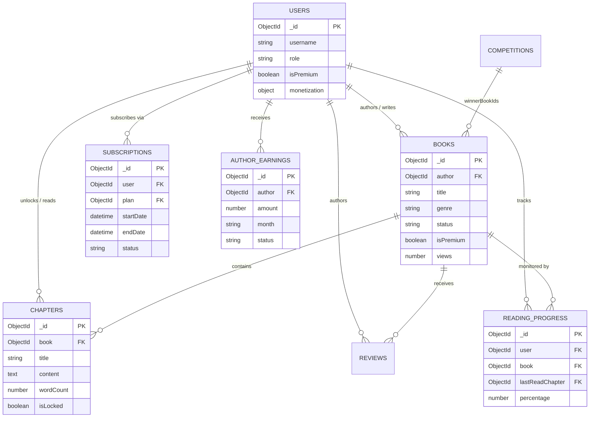

# Database Architecture Document (DAD)

## 1. Document Control
### 1.1 Document Information
| Field | Description |
| :--- | :--- |
| **Document Name** | Database Architecture Document |
| **Project Name** | Mozhibu - Story |
| **Version** | 2.0.0 |
| **Created Date** | 2026-09-12 |
| **Last Updated** | 2026-09-12 |
| **Author(s)** | Architecture Team |
| **Status** | Active |

### 1.2 Revision History
| Version | Date | Author | Description of Changes |
| :--- | :--- | :--- | :--- |
| 1.0.0 | 2026-09-12 | System | Initial Draft |
| 1.1.0 | 2026-09-12 | System | Added architecture and ER diagrams |
| 2.0.0 | 2026-09-12 | System | Updated architecture to match actual MongoDB structure and exact schemas |

---

## 2. Introduction
### 2.1 Purpose
The purpose of this document is to define the database architecture for the **Mozhibu - Story** system. It outlines the structural design, NoSQL data models, storage solutions, security measures, and scalability patterns to serve as a comprehensive guide for developers and stakeholders.

### 2.2 Scope
This document covers the logical and physical data architecture, technology stack, security configurations, high availability, and disaster recovery strategies for the database tier supporting the application backend.

---

## 3. Architectural Overview

### 3.1 High-Level System Architecture
The Mozhibu - Story platform utilizes a distributed Node.js backend connecting to a MongoDB NoSQL database cluster, integrated with Redis for caching and various external services for payments and media storage.

### 3.2 Technology Stack
| Component | Technology / Tool | Version | Justification |
| :--- | :--- | :--- | :--- |
| **Primary Database** | MongoDB | 6.x/7.x | Schema flexibility for dynamic content, high availability via Replica Sets, and horizontal scalability for large read volumes. |
| **Caching Layer** | Redis | 7.x | Extreme low-latency access for user sessions, real-time leaderboard stats, and rate limiting API requests. |
| **ODM Layer** | Mongoose | 8.x | Provides schema validation, typed models, population of references, and lifecycle hooks for Node.js. |
| **Backend Environment** | Node.js (Express) | 18+ | Fast, non-blocking I/O capable of handling thousands of concurrent readers. |

---

## 4. Data Architecture & Modeling

### 4.1 Comprehensive Entity Relationship (ER) Diagram
In a NoSQL context, relationships are managed through document references (ObjectIds). The diagram below illustrates how core collections interlink, including advanced features like monetization, chapters, and reading progress.

---

## 5. Database Schema Details

### 5.1 Naming Conventions
- **Collections**: `CamelCase` in code, pluralized `snake_case` or `lowercase` in DB (e.g., `users`, `books`, `competitions`).
- **Keys/Fields**: `camelCase` (e.g., `favoriteGenres`, `createdAt`).
- **Primary Keys**: `_id` (MongoDB ObjectId).
- **References (Foreign Keys)**: Declared as `mongoose.Schema.Types.ObjectId` with a `ref` property.

### 5.2 Core Collections Data Dictionary

#### Collection: `users`
| Field Name | Type | Constraints | Description |
| :--- | :--- | :--- | :--- |
| `_id` | ObjectId | PK, Auto | Unique document identifier |
| `username` | String | Required | Public username |
| `email` | String | Required, Unique | User's email address |
| `mobile` | String | Required | User's phone number |
| `password` | String | Select: false | Hashed password |
| `preferredLanguage` | String | Required | App language preference |
| `role` | Enum | reader, writer, superadmin | Authorization role |
| `status` | Enum | active, suspended, deactivated | Account standing |
| `isPremium` | Boolean | Default: false | Subscription status |
| `savedBooks` | [ObjectId] | Ref: Book | Array of book references |
| `following` | [ObjectId] | Ref: User | Array of followed users |
| `monetization` | Object | - | Embedded encrypted bank details |

#### Collection: `books`
| Field Name | Type | Constraints | Description |
| :--- | :--- | :--- | :--- |
| `_id` | ObjectId | PK, Auto | Unique document identifier |
| `title` | String | Required | Story/Book title |
| `author` | ObjectId | Ref: User, Required | ID of the author (User) |
| `genre` | String | Required | Book genre |
| `status` | Enum | draft, pending, published, rejected, suspended | Current moderation state |
| `views` | Number | Default: 0 | Total read counts |
| `likes` | [ObjectId] | Ref: User | Array of users who liked it |
| `isAudio` | Boolean | Default: false | Audio availability |
| `accessType` | Enum | free, premium | Paywall setting |
| `reports` | [Object] | Embedded | Array of user reports & reasons |

#### Collection: `competitions`
| Field Name | Type | Constraints | Description |
| :--- | :--- | :--- | :--- |
| `_id` | ObjectId | PK, Auto | Unique document identifier |
| `title` | String | Required | Competition title |
| `isActive` | Boolean | Default: true | Is the competition currently running |
| `endDate` | Date | Required | Deadline for entries |
| `winnerBookIds` | [ObjectId] | Ref: Book | Array of winning stories |

---

## 6. Security Architecture
### 6.1 Authentication & Access Control
- **Application Level**: Role-based access control (RBAC) via the `role` field on the User model (`reader`, `writer`, `superadmin`).
- **Database Level**: Database is accessed using a dedicated service account with constrained privileges, preventing unauthorized collection drops.
- **Network Level**: Database cluster sits in a private subnet, accessible only by the Backend API and trusted VPNs (e.g., via MongoDB Atlas VPC Peering).

### 6.2 Data Security
- **Encryption in Transit**: TLS/SSL required for all MongoDB connections.
- **Encryption at Rest**: Encrypted storage volumes (e.g., via MongoDB Atlas or AWS KMS).
- **Field-Level Security**: Sensitive fields like `password`, `resetPasswordToken`, and `monetization` details are marked as `select: false` in Mongoose and/or explicitly encrypted before storage.

---

## 7. High Availability & Disaster Recovery (HADR)
### 7.1 Replication Strategy
- **MongoDB Replica Set**: Deployed as a 3-node Replica Set (1 Primary, 2 Secondaries) spanning multiple availability zones for automated failover and zero-downtime updates.

### 7.2 Backup & Recovery
- **Continuous Backups**: Point-in-time recovery enabled.
- **Snapshot Frequency**: Daily full cluster snapshots.
- **Retention**: Snapshots retained for 30 days.

---

## 8. Performance & Scalability
### 8.1 Indexing Strategy
- **Unique Indexes**: Applied to `users.email` and `users.penName`.
- **Query Optimizations**: Indexes to be added for highly queried fields (e.g., `books.author`, `books.genre`, `competitions.isActive`).
- **Sparse Indexes**: Utilized for fields that may not exist on all documents (e.g., `penName`).

### 8.2 Scalability
- **Horizontal Scaling**: MongoDB supports sharding if a single collection (like `ReadingProgress` or `Reports`) exceeds a single node's capacity. Currently, the replica set handles read distribution.

---

## 9. Maintenance & Operations
### 9.1 Monitoring
- Monitored via MongoDB Atlas/Cloud Manager for Query Targeting (scanned objects vs. returned), Connection counts, and Disk IOPS.

*End of Document*
